# 🏢 ANTIGRAVITY HRMS — ENTERPRISE HUMAN RESOURCE & PAYROLL SYSTEM

**Enterprise-Grade Production Human Resource, Multi-Shift Attendance, KPI & Payroll Management System**  
*Compliant with Vietnam Labor Code 2026, General Department of Taxation Progressive PIT (7 Brackets), and Social Insurance Regulations*

---

## 1. Executive Summary

**Antigravity HRMS** is an enterprise-grade Human Resource Management and Payroll software built on a **Modular Monolith** architecture with Next.js 16 (App Router, Turbopack) and PostgreSQL 16. It operates under a strict **Zero-Fake Core Flow** guarantee: all calculations (attendance hours, shift penalties, overtime premiums, leave accruals, KPI performance bonuses, social/health/unemployment insurance deductions, progressive personal income tax, and digital payslips) execute through verified deterministic domain engines without mock data in production pathways.

```mermaid
flowchart LR
    EMP[1. Employee & Org] --> SCH[2. Multi-Shift Schedules]
    SCH --> ATT[3. Attendance & GPS/QR]
    ATT --> EXC[4. Adjustment Exceptions]
    EXC --> LEA[5. Leave Management]
    LEA --> KPI[6. KPI Target & Velocity]
    KPI --> REW[7. Bonus & Penalty]
    REW --> PAY[8. Labor Code 2026 Payroll]
    PAY --> APP[9. State Machine Approval]
    APP --> SLIP[10. Anti-IDOR Payslips]
```



---

## 2. Core Functional Pillars

### 2.1. Organizational Structure & Master Employee Roster
- **Tree-Structured Organization**: Multi-level hierarchical departments (`departments`) with manager assignments and parent-child cascading relationships.
- **Position & Salary Bands**: Structured job titles (`positions`) with base salary grade controls (`baseSalaryGrade`, `minSalary`, `maxSalary`) and referential integrity protection.
- **Employee Master Records**: Full demographic, contract (`contractType`, `contractSalary`, `hourlyRate`, `insuranceSalary`), tax code, bank account, and registered dependent records (`dependentsCount`).

### 2.2. Scheduling & Multi-Shift Roster Engine
- **Flexible Shift Models (`work_shifts`)**:
  - `FIXED` (Ca Hành Chính): Standard 8-hour workday with defined lunch breaks (e.g. 08:00 – 17:30).
  - `FLEXIBLE` (Ca Linh Hoạt): Floating check-in/out windows (e.g. 07:30 – 18:30) with required work hour accumulation.
  - `OVERNIGHT` (Ca Đêm): Night shifts crossing midnight (e.g. 22:00 – 06:00 next day) with statutory night work rate calculations.
- **Roster & Recurring Schedules**: Bulk recurring schedules (`recurring_schedules`) and single-day shift assignments with swap workflows.

### 2.3. Dual-Method Secure Attendance
- **Dynamic TOTP QR Kiosk (`/attendance/qr-kiosk`)**:
  - Wall-mounted kiosk screen displaying rotating cryptographic QR tokens refreshed every 20 seconds.
  - HMAC-SHA256 signature verification prevents QR replay, screenshot sharing, and time-travel attacks.
- **Mobile GPS Geofencing**:
  - Worksites defined with precise latitude, longitude, and geofence radius in meters.
  - Client-side coordinate capture verified server-side using the Haversine spherical distance formula with anti-mock location heuristics.

### 2.4. Exceptions & Leave Management
- **Attendance Corrections (`attendance_adjustments`)**: Missing punch and late arrival adjustments submitted by employees with evidence and approved by managers/HR.
- **Leave Management (`leave_requests`)**: Annual leave, sick leave, unpaid leave, and maternity leave. Auto-exclusion of rest days (weekends) and real-time annual leave balance deduction.

### 2.5. KPI Evaluation & Performance Management
- **Target Definitions (`kpis`)**: Departmental or company-wide KPI indicators with quantitative targets and weightings.
- **Achievement Scoring (`employee_kpi_results`)**: Actual achievement evaluation, automated percentage scoring, and performance bonus linkage.

### 2.6. Rewards & Disciplinary Management
- **Rewards (`employee_bonuses_penalties`)**: Performance bonuses, project delivery incentives, and holiday bonuses with formal approval workflows.
- **Penalties**: Disciplinary deductions for safety or compliance infractions with full audit trails and salary deduction integration.

### 2.7. Statutory Payroll Engine (Vietnam Labor Code 2026)
- **Arbitrary Precision Math**: Built with `Decimal.js` to eliminate IEEE 754 floating-point rounding errors on financial values.
- **Statutory Employee Insurances (10.5%)**:
  - Social Insurance (BHXH): $8.0\%$ (capped at 20x base salary)
  - Health Insurance (BHYT): $1.5\%$ (capped at 20x base salary)
  - Unemployment Insurance (BHTN): $1.0\%$ (capped at 20x regional minimum wage)
- **7-Bracket Progressive PIT (Thuế TNCN)**:
  - Bracket 1 (0 – 5M @ 5%), Bracket 2 (5 – 10M @ 10%), Bracket 3 (10 – 18M @ 15%), Bracket 4 (18 – 32M @ 20%), Bracket 5 (32 – 52M @ 25%), Bracket 6 (52 – 80M @ 30%), Bracket 7 (> 80M @ 35%).
- **Statutory Family Relief**: Personal deduction $11,000,000\text{ VND}$ + Dependent deduction $4,400,000\text{ VND/dependent}$.
- **Tax-Exempt Overtime Premium**: Excludes the statutory $50\%$ overtime premium from taxable income.
- **Banking Rounding**: Rounds net salary to the nearest $1,000\text{ VND}$ (`HALF_UP`) with transparent `roundingAdjustment` tracking.

### 2.8. Payroll Lifecycle & Digital Payslips
- **State Machine Workflow**: Strict linear transitions (`DRAFT` $\to$ `CALCULATED` $\to$ `REVIEW` $\to$ `APPROVED` $\to$ `PAID`).
- **Immutability Lock**: Approved periods reject any recalculation, adjustment, or mutation.
- **Anti-IDOR Electronic Payslips**: Streaming vector PDF payslip generation (`pdfkit`) with strict employee self-ownership access control.

---

## 3. Technology Stack

| Layer | Technology | Version / Specification |
| :--- | :--- | :--- |
| **Framework** | Next.js (App Router, Turbopack) | 16.3.4 |
| **Runtime & Language** | Node.js / TypeScript (Strict Mode) | Node 20+ / TypeScript 5.9 |
| **UI Library** | React | 19.2.8 |
| **Styling & Theme** | Tailwind CSS v4 / Lucide Icons | Royal Luxury Dark Theme |
| **Database & ORM** | PostgreSQL 16 / Prisma ORM | Prisma 6.19.3 (3NF Schema, 26 Tables) |
| **Cache & Sessions** | Redis / Jose JWT | Redis 7 Alpine / HS256 Signed Cookies |
| **Precision Math** | Decimal.js | Decimal v10.6.0 |
| **Document Processing** | PDFKit / ExcelJS | Vector PDF & OpenXML Excel (.xlsx) |
| **Test Engine** | Vitest | Vitest 4.1.11 (30 suites, 498 tests) |
| **Containerization** | Docker / Docker Compose | Multi-stage Alpine Standalone (~250MB) |

---

## 4. Project Structure

```
antigravity-hrms/
├── .github/workflows/          # GitHub Actions CI/CD pipelines (ci.yml, docker-publish.yml)
├── docker/                     # Container configuration & database init scripts
├── docs/                       # Technical architecture & specification suite
│   ├── ARCHITECTURE.md         # System architecture & component topology
│   ├── DATABASE_DESIGN.md      # 3NF database schema & index specification
│   ├── API_DESIGN.md           # RESTful API endpoints & contract definitions
│   ├── RBAC_MATRIX.md          # 5-Role permission & data scoping matrix
│   ├── PAYROLL_ARCHITECTURE.md # Labor Code 2026 mathematical engine design
│   ├── SECURITY.md             # OWASP Top 10 compliance & security hardening
│   ├── TESTING.md              # Test pyramid, quality gates & verification suites
│   └── DEPLOYMENT.md           # Operations, backup/restore & disaster recovery runbook
├── prisma/
│   ├── schema.prisma           # 26 relational models with full constraints
│   ├── migrations/             # Versioned PostgreSQL migration files (20260901000000_init)
│   └── seed.ts                 # Real-world Vietnamese enterprise seed data
├── scripts/
│   └── simulate-enterprise.ts  # Standalone CLI 10-stage enterprise simulation script
├── src/
│   ├── app/                    # Next.js 16 App Router (13 pages, 79 API routes)
│   ├── components/             # Reusable UI primitives, AppShell, Navigation, Skeletons
│   ├── lib/
│   │   ├── auth/               # Session management, bcrypt passwords, route guards
│   │   ├── cache/              # Redis caching & rate limiting
│   │   ├── db/                 # Prisma client singleton
│   │   ├── errors/             # Standardized ApiError & AppError hierarchy
│   │   ├── logger/             # Structured JSON logger
│   │   ├── payroll/            # Decimal math, statutory engines, PDF generator
│   │   ├── security/           # Sanitizers, upload validators, file storage
│   │   ├── services/           # Domain business logic services
│   │   └── validations/        # Zod request & input validation schemas
│   └── types/                  # Global TypeScript type definitions
├── Dockerfile                  # Multi-stage production container build
├── docker-compose.yml          # Production Docker Compose orchestration
├── docker-compose.prod.yml     # Production hardened overrides
├── docker-entrypoint.sh        # Startup script (DB check -> migrate -> seed -> exec)
├── FINAL_RELEASE_REPORT.md     # Official Phase 28 release audit report
└── package.json                # Dependencies, scripts & engine requirements
```

---

## 5. Quickstart & Deployment

### 5.1. Local Development Setup

1. **Clone repository and install dependencies**:
   ```bash
   git clone <repository-url> antigravity-hrms
   cd antigravity-hrms
   npm install
   ```

2. **Configure environment variables**:
   ```bash
   cp .env.example .env
   # Ensure DATABASE_URL and AUTH_SECRET are configured
   ```

3. **Deploy database migrations & seed enterprise data**:
   ```bash
   npm run db:migrate:prod
   npm run db:seed
   ```

4. **Start development server**:
   ```bash
   npm run dev
   ```
   Access the application at `http://localhost:3000`.

---

### 5.2. Production Deployment via Docker Compose

Deploy the complete containerized stack (Next.js Standalone App + PostgreSQL 16 + Redis 7 + One-shot Migrate Job):

```bash
# 1. Start production stack in background
docker compose -f docker-compose.yml -f docker-compose.prod.yml up -d

# 2. Inspect running services and health status
docker compose ps

# 3. View real-time application logs
docker compose logs -f app
```

---

### 5.3. Standalone Enterprise Simulation

Run the complete 10-stage real-world business simulation from the terminal:

```bash
npm run simulate:enterprise
```

Outputs a comprehensive ASCII dashboard displaying employee rosters, attendance records, KPI scores, statutory payroll breakdowns, and electronic payslips.

---

## 6. Verification Quality Gates

All pull requests and release candidates must pass the complete quality gate suite:

| Quality Gate | Command | Passing Threshold |
| :--- | :--- | :--- |
| **Unit & Integration Tests** | `npm test -- --run` | 30/30 suites passed, 498/498 tests passed |
| **TypeScript Strict Checking** | `npx tsc --noEmit` | 0 errors (Exit code 0) |
| **ESLint Static Analysis** | `npm run lint` | 0 errors (Exit code 0) |
| **Next.js Production Build** | `npm run build` | 79/79 routes compiled in standalone mode |
| **Database Migration Integrity**| `npm run db:migrate:prod` | All migrations applied without schema drift |

---

## 7. Security & Compliance

- **Authentication**: Salted Bcrypt (cost factor 12) password hashing with timing attack mitigation.
- **Session Tokens**: Cryptographically signed `HS256` JWTs inside `HttpOnly`, `SameSite: 'lax'`, `Secure` cookies.
- **Role-Based Access Control**: 5 system roles (`SUPER_ADMIN`, `HR_ADMIN`, `PAYROLL_OFFICER`, `DEPARTMENT_MANAGER`, `EMPLOYEE`) with data scoping (`GLOBAL`, `DEPARTMENT`, `SELF`).
- **Anti-IDOR Enforcement**: Explicit caller ownership validation on sensitive routes (e.g. `/api/v1/payroll/payslips/[id]/pdf`).
- **File Upload Security**: Extension whitelisting, MIME validation, binary magic-byte inspection, path traversal neutralization, and size bounds (max 5MB).
- **Audit Observability**: Centralized, immutable `audit_logs` table tracking 8 critical business events.

---

## 8. License

Internal Enterprise Software — Proprietary. All rights reserved.
