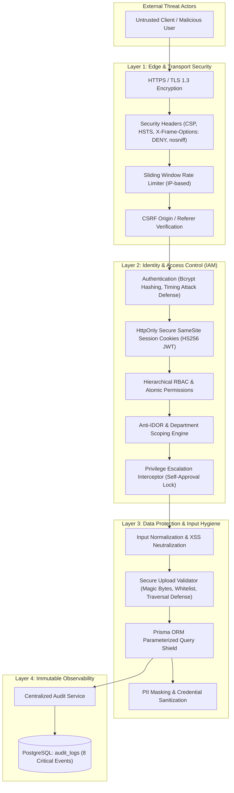

# 🛡️ ANTIGRAVITY HRMS — SYSTEM SECURITY POLICY & AUDIT SPECIFICATION

**Version:** 1.0.0 (Production-Grade Security Hardening)  
**Standard:** OWASP Top 10 Enterprise Compliance, ISO/IEC 27001 Reference Controls  
**Classification:** Internal Technical Architecture & Security Contract  

---

## 1. Security Philosophy & Threat Model

Antigravity HRMS is an enterprise Human Resource and Payroll Management System handling sensitive personal identifiable information (PII), biometric/GPS attendance records, and financial compensation data. The core security philosophy follows **Zero Trust**, **Least Privilege**, and **Defense-in-Depth**.

### Threat Vectors & Attack Surface



---

## 2. The 13 Security Hardening Pillars

### 2.1. Authentication
- **Password Hashing:** Passwords are encrypted using high-cost multi-round bcrypt with unique salt generation. Passwords are never stored in plaintext or reversible formats.
- **Timing Attack Mitigation:** Generic error messages (`"Email hoặc mật khẩu không chính xác."`) are returned for both invalid email addresses and incorrect passwords to prevent user enumeration.
- **Account Status Gating:** Inactive (`isActive = false`) or terminated accounts are immediately rejected with `403 Forbidden` both at authentication and downstream middleware validation.
- **Last Login Tracking:** Successful logins asynchronously record IP addresses, user agents, and timestamps.

### 2.2. Authorization & RBAC
- **Four Standard Roles:**
  - `admin`: Full administrative control across all organizational units, salary grades, rules, and system configurations.
  - `hr`: Comprehensive human resources management across all employees, leaves, attendances, and payroll reviews.
  - `manager`: Department-scoped management over direct reports. Strictly prohibited from accessing or modifying records outside their managed department.
  - `employee`: Self-scoped access restricted to individual profile, attendance, leave requests, and payslips.
- **Server-Side Enforcement:** Route-level guards (`requireAuth`, `requireRole`, `requirePermission`) enforce authorization on every API route handler before business logic execution.

### 2.3. Anti-IDOR (Insecure Direct Object Reference)
- **Scoping Rule:** An employee can never query or manipulate records belonging to another employee by tampering with IDs in URL paths or request bodies.
- **Implementation:** `verifyOwnershipOrAdmin` and `applyDataScope` validate that incoming requests match `session.employeeId` or `session.userId` unless the caller possesses `admin` or `hr` roles.
- **Department Boundary Enforcement:** Managers are constrained to `session.departmentId` and cannot read or write data for other business units.

### 2.4. Privilege Escalation Prevention
- **Manager Salary Modification Lock:** Managers cannot modify salary-sensitive fields (`contractSalary`, `hourlyRate`, `insuranceSalary`, `contractType`, `taxCode`, `bankAccountNo`). Attempting to do so triggers an immediate `403 Forbidden`.
- **Self-Approval Prohibition:**
  - Managers cannot approve their own attendance correction requests.
  - Managers cannot approve their own bonus proposals.
  - Managers cannot approve/reject disciplinary penalties applied to themselves.
- **Sole Admin Protection:** An administrator cannot remove their own admin privileges if they are the last active administrator, preventing systemic lockout.

### 2.5. Cross-Site Scripting (XSS)
- **Automatic JSX Escaping:** All dynamic content rendered through React components is automatically escaped.
- **Content Security Policy (CSP):** Enforced via HTTP response headers:
  ```http
  Content-Security-Policy: default-src 'self'; script-src 'self' 'unsafe-inline' 'unsafe-eval'; style-src 'self' 'unsafe-inline'; img-src 'self' data: https: blob:; font-src 'self' data:; connect-src 'self'
  ```
- **Input Sanitization:** `stripDangerousTags` removes `<script>`, `<iframe>`, `<embed>`, `<object>`, `javascript:` pseudo-protocols, and inline event handlers (`onload`, `onerror`).

### 2.6. SQL Injection (SQLi)
- **Zero Raw String Concatenation:** All database transactions and queries use Prisma ORM with parameterized queries.
- **Type Safety:** Input types are validated via Zod schemas before database persistence.

### 2.7. Cross-Site Request Forgery (CSRF)
- **SameSite Cookies:** Session cookies use `SameSite: 'lax'`, preventing automatic submission on cross-site requests.
- **Origin / Referer Validation:** Middleware validates that incoming mutating requests (`POST`, `PUT`, `PATCH`, `DELETE`) match the server's `Host` header. Cross-origin mutations are rejected with `403 Forbidden`.

### 2.8. Insecure File Upload
- **Extension Whitelist:** Only `.pdf`, `.jpg`, `.jpeg`, `.png`, `.webp`, `.docx`, `.xlsx` are accepted.
- **MIME Verification:** Declared MIME types are validated against whitelist specifications.
- **Magic Byte Inspection:** Binary signatures are validated against file headers (e.g. `%PDF`, `RIFF`, JPEG headers) to prevent extension spoofing.
- **Path Traversal Defense:** `sanitizeFilename` removes null bytes (`\0`), directory traversal sequences (`../`, `..\`), and shell control characters.
- **Size Bounds:** Enforces strict limits (default max 5 MB). Empty files are rejected.

### 2.9. Session Security
- **Cookie Security:** The authentication cookie `antigravity_session` is configured with:
  - `httpOnly: true` (inaccessible to client JavaScript, preventing XSS-based session theft)
  - `secure: true` (enforced in production environments)
  - `sameSite: 'lax'`
  - `path: '/'`
  - `maxAge: 7 * 24 * 3600` (7-day sliding expiration)
- **Cryptographic Signing:** Sessions are signed and verified using `jose` with `HS256` using an enterprise-grade 32+ character secret.

### 2.10. Rate Limiting & Brute Force Defense
- **Sliding Window Rate Limiter:** An in-memory sliding window rate limiter protects endpoints against brute-force credential stuffing and denial of service.
- **Login Protection:** Maximum 5 failed attempts per minute per IP address.
- **Automatic Reset:** Successful authentication clears the rate limit counter for the IP.

### 2.11. Sensitive Data Exposure
- **Credential Stripping:** Password hashes and raw credentials are never returned in API payloads (`SanitizedUser` DTO).
- **PII Masking:** Helper utilities provide masking for national identity cards (`maskIdentityCard`), bank accounts (`maskBankAccount`), and phone numbers (`maskPhoneNumber`).
- **Sanitized Errors:** Error handlers catch internal exceptions and return standardized, safe JSON responses (`ApiError`) without exposing database connection strings or environment secrets.

### 2.12. Secrets Exposure Prevention
- **Environment Isolation:** Sensitive configurations (`DATABASE_URL`, `AUTH_SECRET`, `SMTP_PASSWORD`) are loaded strictly via environment variables.
- **Version Control Exclusions:** `.env`, `.env.local`, and build artifacts are excluded in `.gitignore`.

---

## 3. Centralized Audit Logging (`audit_logs`)

All sensitive and business-critical operations are recorded in the immutable `audit_logs` table.

### Schema Specification
| Field | Type | Description |
| :--- | :--- | :--- |
| `id` | UUID (PK) | Unique audit log identifier |
| `actor_id` | UUID (FK) | Reference to `users.id` who performed the action |
| `action` | String | Event classification code |
| `entity` | String | Affected domain table or model |
| `entity_id` | String | Identifier of the affected record |
| `old_values` | JSONB | State snapshot prior to change |
| `new_values` | JSONB | State snapshot after change |
| `ip_address` | String | Client IP address |
| `user_agent` | String | Client browser / device user agent |
| `created_at` | Timestamp | Non-modifiable timestamp |

### The 8 Critical Business Events

| # | Event Code | Trigger Condition | Captured Metadata |
| :---: | :--- | :--- | :--- |
| **1** | `SALARY_MODIFICATION` | Any change to `contractSalary`, `hourlyRate`, or `insuranceSalary` in `EmployeeService.updateEmployee` | Old vs new salary amounts, hourly rate, insurance salary, contract type |
| **2** | `ATTENDANCE_CORRECTION` | Approval or override of an attendance adjustment in `AttendanceCorrectionService.processCorrection` | Old attendance times vs requested/approved check-in/out times |
| **3** | `BONUS_APPROVAL` | Approval of employee reward proposal in `BonusService.processBonus` | Approved amount, bonus category, period, approver ID |
| **4** | `PENALTY_APPROVAL` | Approval of disciplinary penalty in `PenaltyService.processPenalty` | Deducted amount, penalty category, reason, approver ID |
| **5** | `PAYROLL_CALCULATION` | Calculation execution of a payroll period in `PayrollService.calculatePeriod` | Total employees processed, gross payout, net payout, calculation timestamp |
| **6** | `PAYROLL_APPROVAL` | Transition of payroll period status to `APPROVED` in `PayrollWorkflowService.transitionStatus` | Review stage, comments, reviewer identity, approval timestamp |
| **7** | `PAYROLL_PAYMENT` | Confirmation of payroll disbursement (`PAID`) in `PayrollWorkflowService.transitionStatus` | Target period, disbursement status, actor email, payment timestamp |
| **8** | `PERMISSION_CHANGE` | Assignment or alteration of user roles/permissions in `PermissionService` | Target user, previous roles, newly assigned roles, modifying actor |

---

## 4. Vulnerability Disclosure & Incident Response

### Reporting a Security Issue
If you discover a security vulnerability in Antigravity HRMS, please report it confidentially to:
- **Email:** `security@antigravity.internal`
- **Response SLA:** Initial acknowledgment within 24 hours; remediation within 72 hours for critical severity issues.

### Incident Response Protocol
1. **Identification & Triage:** Incident classification via CVSS v3.1 scoring.
2. **Containment:** Revoke affected session tokens, block offending IP addresses, or disable compromised accounts via `isActive = false`.
3. **Forensic Audit:** Trace malicious activity through `audit_logs` using actor ID, entity ID, and timestamp ranges.
4. **Remediation & Patching:** Implement safe atomic code fixes verified against unit and integration test suites.
5. **Post-Mortem:** Document root cause, affected scope, and preventive measures.
