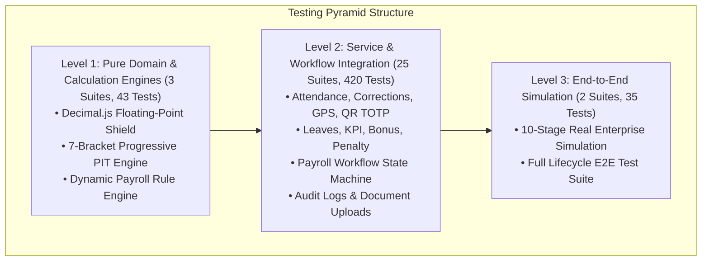

# 🧪 ANTIGRAVITY HRMS — SYSTEM TESTING SPECIFICATION & QA QUALITY GATES

**Document Version:** 1.0.0 (Production Release)  
**Classification:** Engineering Standard & Verification Contract  
**Test Framework:** Vitest v4.1.11, TypeScript Strict Mode, Next.js Turbopack  

---

## 1. Testing Philosophy & Architecture

Antigravity HRMS adheres to a **Zero-Fake Core Flow** and **High-Fidelity Automated Verification** philosophy. Every business calculation, state transition, and security boundary is tested through executable specifications that prove system correctness under both standard and edge-case operational conditions.

### The Antigravity Testing Pyramid



---

## 2. Test Suites Distribution (30 Test Files, 498 Passed Tests)

### 2.1. Domain & Mathematical Calculation Engines (`src/lib/payroll/__tests__/`)
| Test Suite | Tests | Domain Focus |
| :--- | :---: | :--- |
| `decimal-math.test.ts` | 7 | IEEE 754 precision loss elimination, currency addition, multiplication, division, bankers rounding |
| `payroll-calculation-engine.test.ts` | 18 | Labor Code 2026 statutory rules, 7-bracket PIT, 10.5% insurances, 11M/4.4M family deductions |
| `payroll-rule-engine.test.ts` | 18 | Dynamic rule evaluation, formula parsing, condition AST resolution, parameter overrides |

### 2.2. Authentication & Authorization Security (`src/lib/auth/__tests__/`)
| Test Suite | Tests | Domain Focus |
| :--- | :---: | :--- |
| `auth.test.ts` | 14 | Bcrypt password hashing (cost factor 12), token issuance, timing attack defense, role validation |
| `api_auth.test.ts` | 11 | HTTP Route guard execution, bearer tokens, cookie extraction, expired token revocation |

### 2.3. Core HRMS Services (`src/lib/services/__tests__/`)
| Test Suite | Tests | Domain Focus |
| :--- | :---: | :--- |
| `organization.service.test.ts` | 14 | Tree-structure departments, positions, salary grade limits, referential integrity guards |
| `employee.service.test.ts` | 15 | Employee lifecycle, contract assignment, tax code validation, soft-delete archival |
| `shift.service.test.ts` | 37 | Fixed, Flexible, and Overnight shifts (midnight crossing), roster scheduling |
| `attendance.service.test.ts` | 21 | Standard check-in/out, late arrival, early departure, overtime (OT 150%, 200%, 300%) |
| `attendance-correction.service.test.ts` | 18 | Missing punch exception, adjustment submission, manager approval workflow |
| `qr-attendance.service.test.ts` | 13 | Rotating TOTP QR tokens (20s cycle), cryptographic HMAC-SHA256 signature verification |
| `gps-attendance.service.test.ts` | 17 | Haversine distance geofencing, radius tolerance, mock location defense |
| `leave.service.test.ts` | 24 | Annual leave accrual, request approval, weekend auto-exclusion, paid leave preservation |
| `kpi.service.test.ts` | 20 | Target metrics, actual achievement, score calculation, performance tier bonuses |
| `bonus.service.test.ts` | 17 | Performance reward proposal, approval lifecycle, status transitions |
| `penalty.service.test.ts` | 15 | Disciplinary infraction recording, approval lifecycle, payroll deduction |
| `payroll.service.test.ts` | 6 | Period calculation, batch employee processing, allowance aggregation |
| `payroll-workflow.service.test.ts` | 12 | State machine transitions (`DRAFT` $\to$ `CALCULATED` $\to$ `REVIEW` $\to$ `APPROVED`), immutability locks |
| `payroll-rule.service.test.ts` | 6 | Default statutory rule assignment, company-wide payroll parameter management |
| `payslip.service.test.ts` | 10 | Electronic payslip generation, PDF streaming, Anti-IDOR cross-user protection |
| `audit.service.test.ts` | 25 | Immutable audit logging for 8 critical events, actor attribution, change diff tracking |
| `document.service.test.ts` | 20 | Magic-byte file upload validation, extension whitelisting, traversal defenses |
| `dashboard.service.test.ts` | 7 | Real-time metric aggregation for Admin, Manager, and Employee roles |
| `notification.service.test.ts` | 12 | In-app notification dispatch, unread counters, bulk mark-as-read |
| `report.service.test.ts` | 14 | OpenXML Excel (.xlsx) and PDF stream generation, 1,000-record stress testing |
| `worksite.service.test.ts` | 11 | Geofence coordinates management, radius validation, active site toggles |
| `production-audit.test.ts` | 12 | Batch query optimization (`{ in: employeeIds }`), background job runners |

### 2.4. End-to-End Simulation & Verification Suites
| Test Suite | Tests | Domain Focus |
| :--- | :---: | :--- |
| `e2e-full-system.test.ts` | 25 | Full lifecycle validation from employee onboarding to payroll payout |
| `enterprise-simulation.test.ts` | 10 | 10-Stage Vietnamese Enterprise Simulation (Tan Phong Tech JSC) with 0 fake core flow data |

---

## 3. Statutory Payroll & Mathematical Verification

The payroll test suite verifies the absolute mathematical correctness of Vietnamese statutory deductions under the 2026 Labor Code:

1. **Statutory Employee Insurances (10.5%)**:
   - Social Insurance (BHXH): $8.0\%$ (capped at 20x base salary)
   - Health Insurance (BHYT): $1.5\%$ (capped at 20x base salary)
   - Unemployment Insurance (BHTN): $1.0\%$ (capped at 20x regional minimum wage)
2. **Personal Income Tax (7-Bracket Progressive PIT)**:
   - Bracket 1: Up to 5,000,000 VND $\times 5\%$
   - Bracket 2: 5,000,000 – 10,000,000 VND $\times 10\%$
   - Bracket 3: 10,000,000 – 18,000,000 VND $\times 15\%$
   - Bracket 4: 18,000,000 – 32,000,000 VND $\times 20\%$
   - Bracket 5: 32,000,000 – 52,000,000 VND $\times 25\%$
   - Bracket 6: 52,000,000 – 80,000,000 VND $\times 30\%$
   - Bracket 7: Over 80,000,000 VND $\times 35\%$
3. **Statutory Family Deductions**:
   - Personal Relief: $11,000,000\text{ VND/month}$
   - Dependent Relief: $4,400,000\text{ VND/month per registered dependent}$
4. **Tax-Exempt Overtime Premium**:
   - The $50\%$ extra premium on standard overtime ($150\% - 100\% = 50\%$) is mathematically excluded from taxable income before bracket evaluation.
5. **Banking Rounding Rule**:
   - Vietnamese banking standards require cash/transfer amounts to be rounded to the nearest $1,000\text{ VND}$ (`HALF_UP`). The difference is tracked transparently as `roundingAdjustment`.

---

## 4. Quality Gate Execution Commands

Developers and CI/CD pipelines must execute the following commands before code is merged or released:

```bash
# 1. Run all unit, integration, and E2E tests
npm test -- --run

# 2. Run targeted test file
npx vitest run src/lib/services/__tests__/enterprise-simulation.test.ts

# 3. Run enterprise CLI simulation dashboard
npm run simulate:enterprise

# 4. Strict TypeScript static verification
npx tsc --noEmit

# 5. ESLint static code quality check
npm run lint

# 6. Production Next.js 16 standalone build
npm run build
```

---

## 5. Continuous Integration (CI/CD) Gates

The GitHub Actions CI pipeline ([`.github/workflows/ci.yml`](file:///C:/Users/LNV/.gemini/antigravity-ide/scratch/antigravity-hrms/.github/workflows/ci.yml)) automatically validates every pull request:

```mermaid
flowchart LR
    Lint[1. ESLint] --> TSC[2. TypeScript]
    TSC --> Vitest[3. Vitest (498 Tests)]
    Vitest --> Build[4. Standalone Build]
    Build --> Docker[5. Docker Compose Config]
```

All 5 stages must complete with exit code 0 for any release candidate to be marked as **`PRODUCTION READY`**.
