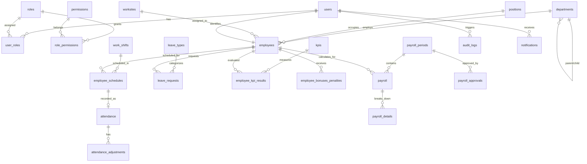

# ANTIGRAVITY MASTER PROJECT — DATABASE ARCHITECTURE & SCHEMA DESIGN
**Hệ Thống Cơ Sở Dữ Liệu Quan Hệ Chuẩn Enterprise (PostgreSQL & Prisma)**  
*Document Version: 1.0.0 | Status: APPROVED | Target: PostgreSQL 16+*

---

## 1. TỔNG QUAN THIẾT KẾ CƠ SỞ DỮ LIỆU

Cơ sở dữ liệu được thiết kế theo chuẩn dạng chuẩn 3 (3NF), loại bỏ hoàn toàn dư thừa dữ liệu bất hợp lý, bảo đảm tính toàn vẹn tham chiếu (Referential Integrity) qua các khóa ngoại (Foreign Keys) nghiêm ngặt, cơ chế chống xóa nhầm (Soft Delete via `deleted_at`), và hệ thống chỉ mục phức hợp (Compound Indexes) tối ưu hóa cho các truy vấn thời gian thực và xử lý khối lượng lớn (Batch calculation).

---

## 2. SƠ ĐỒ THỰC THỂ LIÊN KẾT (ENTITY RELATIONSHIP DIAGRAM)



---

## 3. ĐẶC TẢ CHI TIẾT CÁC BẢNG DỮ LIỆU (DATA DICTIONARY)

### 3.1. Phân Hệ Xác Thực & Phân Quyền (IAM & RBAC)

#### `users` (Tài khoản người dùng)
| Cột | Kiểu dữ liệu | Ràng buộc | Mô tả |
| :--- | :--- | :--- | :--- |
| `id` | `VARCHAR(36)` | PK, UUID | Khóa chính |
| `email` | `VARCHAR(255)` | UNIQUE, NOT NULL | Email đăng nhập |
| `password_hash`| `VARCHAR(255)` | NOT NULL | Mật khẩu băm (Argon2id/bcrypt) |
| `is_active` | `BOOLEAN` | DEFAULT TRUE | Trạng thái kích hoạt |
| `last_login_at`| `TIMESTAMPTZ` | NULLABLE | Lần đăng nhập cuối |
| `created_at` | `TIMESTAMPTZ` | DEFAULT NOW() | Thời điểm tạo |
| `updated_at` | `TIMESTAMPTZ` | DEFAULT NOW() | Thời điểm cập nhật |
| `deleted_at` | `TIMESTAMPTZ` | NULLABLE | Đánh dấu xóa mềm |

#### `roles` (Vai trò)
| Cột | Kiểu dữ liệu | Ràng buộc | Mô tả |
| :--- | :--- | :--- | :--- |
| `id` | `VARCHAR(36)` | PK, UUID | Khóa chính |
| `code` | `VARCHAR(50)` | UNIQUE, NOT NULL | Mã vai trò (`SUPER_ADMIN`, `HR_ADMIN`, v.v.) |
| `name` | `VARCHAR(100)` | NOT NULL | Tên hiển thị |
| `description` | `TEXT` | NULLABLE | Mô tả quyền hạn của vai trò |

#### `permissions` (Danh mục quyền nguyên tử)
| Cột | Kiểu dữ liệu | Ràng buộc | Mô tả |
| :--- | :--- | :--- | :--- |
| `id` | `VARCHAR(36)` | PK, UUID | Khóa chính |
| `code` | `VARCHAR(100)` | UNIQUE, NOT NULL | Mã quyền nguyên tử (`attendance:checkin`, v.v.) |
| `module` | `VARCHAR(50)` | NOT NULL | Phân hệ thuộc về (`ATTENDANCE`, `PAYROLL`, v.v.) |
| `description` | `TEXT` | NULLABLE | Ý nghĩa của quyền |

#### `role_permissions` & `user_roles` (Bảng nối n-n)
- `role_permissions`: `(role_id, permission_id)` - Composite Primary Key.
- `user_roles`: `(user_id, role_id)` - Composite Primary Key.

---

### 3.2. Phân Hệ Cơ Cấu Tổ Chức & Nhân Sự (Organization & HR)

#### `departments` (Phòng ban)
| Cột | Kiểu dữ liệu | Ràng buộc | Mô tả |
| :--- | :--- | :--- | :--- |
| `id` | `VARCHAR(36)` | PK, UUID | Khóa chính |
| `code` | `VARCHAR(50)` | UNIQUE, NOT NULL | Mã phòng ban (`DEV`, `HR`, `FINANCE`) |
| `name` | `VARCHAR(150)` | NOT NULL | Tên phòng ban |
| `parent_id` | `VARCHAR(36)` | FK -> `departments(id)`, NULL | Phòng ban cha (cây tổ chức) |
| `manager_id` | `VARCHAR(36)` | FK -> `employees(id)`, NULL | Trưởng phòng |
| `created_at` | `TIMESTAMPTZ` | DEFAULT NOW() | Ngày tạo |

#### `positions` (Vị trí / Chức vụ)
| Cột | Kiểu dữ liệu | Ràng buộc | Mô tả |
| :--- | :--- | :--- | :--- |
| `id` | `VARCHAR(36)` | PK, UUID | Khóa chính |
| `code` | `VARCHAR(50)` | UNIQUE, NOT NULL | Mã vị trí (`DEV_LEAD`, `HR_EXEC`, v.v.) |
| `title` | `VARCHAR(150)` | NOT NULL | Tên chức danh |
| `base_salary_grade`| `DECIMAL(14,2)`| DEFAULT 0 | Bậc lương khởi điểm gợi ý |

#### `worksites` (Địa điểm làm việc & Tọa độ Geofence)
| Cột | Kiểu dữ liệu | Ràng buộc | Mô tả |
| :--- | :--- | :--- | :--- |
| `id` | `VARCHAR(36)` | PK, UUID | Khóa chính |
| `name` | `VARCHAR(150)` | NOT NULL | Tên địa điểm (Trụ sở chính, Chi nhánh 1) |
| `address` | `TEXT` | NOT NULL | Địa chỉ thực tế |
| `latitude` | `DECIMAL(10,8)`| NOT NULL | Vĩ độ GPS |
| `longitude` | `DECIMAL(11,8)`| NOT NULL | Kinh độ GPS |
| `radius_meters` | `INTEGER` | DEFAULT 100 | Bán kính hợp lệ cho phép chấm công (m) |
| `is_active` | `BOOLEAN` | DEFAULT TRUE | Trạng thái hoạt động |

#### `employees` (Hồ sơ nhân viên Master Record)
| Cột | Kiểu dữ liệu | Ràng buộc | Mô tả |
| :--- | :--- | :--- | :--- |
| `id` | `VARCHAR(36)` | PK, UUID | Khóa chính |
| `user_id` | `VARCHAR(36)` | FK -> `users(id)`, UNIQUE | Tài khoản liên kết hệ thống |
| `employee_code`| `VARCHAR(30)` | UNIQUE, NOT NULL | Mã nhân viên chuẩn (`EMP-2026-0001`) |
| `first_name` | `VARCHAR(50)` | NOT NULL | Tên |
| `last_name` | `VARCHAR(100)` | NOT NULL | Họ và tên đệm |
| `gender` | `VARCHAR(10)` | CHECK (gender IN ('MALE','FEMALE','OTHER')) | Giới tính |
| `dob` | `DATE` | NOT NULL | Ngày sinh |
| `identity_card`| `VARCHAR(20)` | UNIQUE, NOT NULL | Số CCCD / Hộ chiếu |
| `phone_number` | `VARCHAR(20)` | NOT NULL | Số điện thoại liên hệ |
| `department_id`| `VARCHAR(36)` | FK -> `departments(id)`, NOT NULL | Phòng ban trực thuộc |
| `position_id` | `VARCHAR(36)` | FK -> `positions(id)`, NOT NULL | Vị trí đảm nhiệm |
| `worksite_id` | `VARCHAR(36)` | FK -> `worksites(id)`, NOT NULL | Địa điểm làm việc đăng ký |
| `hire_date` | `DATE` | NOT NULL | Ngày bắt đầu công tác |
| `contract_type`| `VARCHAR(30)` | NOT NULL | `PROBATION`, `FIXED_TERM`, `INDEFINITE` |
| `contract_salary`| `DECIMAL(14,2)`| NOT NULL | Lương thỏa thuận trên hợp đồng |
| `insurance_salary`| `DECIMAL(14,2)`| NOT NULL | Mức lương làm căn cứ đóng BHXH |
| `tax_code` | `VARCHAR(30)` | NULLABLE | Mã số thuế cá nhân |
| `dependents_count`| `INTEGER` | DEFAULT 0 | Số người phụ thuộc giảm trừ gia cảnh |
| `bank_account_no`| `VARCHAR(50)`| NOT NULL | Số tài khoản ngân hàng |
| `bank_name` | `VARCHAR(100)` | NOT NULL | Ngân hàng thụ hưởng |
| `status` | `VARCHAR(20)` | DEFAULT 'ACTIVE' | `ACTIVE`, `PROBATION`, `TERMINATED`, `ON_LEAVE` |
| `created_at` | `TIMESTAMPTZ` | DEFAULT NOW() | Thời điểm tạo |
| `updated_at` | `TIMESTAMPTZ` | DEFAULT NOW() | Thời điểm sửa |
| `deleted_at` | `TIMESTAMPTZ` | NULLABLE | Xóa mềm |

---

### 3.3. Phân Hệ Ca Làm Việc, Phân Lịch & Chấm Công (Time & Attendance)

#### `work_shifts` (Danh mục ca làm việc)
| Cột | Kiểu dữ liệu | Ràng buộc | Mô tả |
| :--- | :--- | :--- | :--- |
| `id` | `VARCHAR(36)` | PK, UUID | Khóa chính |
| `code` | `VARCHAR(30)` | UNIQUE, NOT NULL | Mã ca (`SHIFT_MORNING`, `SHIFT_NIGHT`) |
| `name` | `VARCHAR(100)` | NOT NULL | Tên ca |
| `start_time` | `TIME` | NOT NULL | Giờ bắt đầu (e.g. 08:00:00) |
| `end_time` | `TIME` | NOT NULL | Giờ kết thúc (e.g. 17:00:00) |
| `break_minutes`| `INTEGER` | DEFAULT 60 | Thời gian nghỉ giữa ca (phút) |
| `is_overnight` | `BOOLEAN` | DEFAULT FALSE | Cờ ca xuyên đêm qua ngày hôm sau |
| `grace_period_late`| `INTEGER` | DEFAULT 15 | Phút cho phép đi muộn không bị tính phạt |
| `grace_period_early`| `INTEGER` | DEFAULT 15 | Phút cho phép về sớm không bị tính phạt |
| `standard_work_hours`| `DECIMAL(4,2)`| DEFAULT 8.00 | Số giờ công tiêu chuẩn |

#### `employee_schedules` (Lịch làm việc phân ca chi tiết)
| Cột | Kiểu dữ liệu | Ràng buộc | Mô tả |
| :--- | :--- | :--- | :--- |
| `id` | `VARCHAR(36)` | PK, UUID | Khóa chính |
| `employee_id` | `VARCHAR(36)` | FK -> `employees(id)`, NOT NULL | Nhân viên |
| `shift_id` | `VARCHAR(36)` | FK -> `work_shifts(id)`, NOT NULL | Ca làm việc |
| `work_date` | `DATE` | NOT NULL | Ngày làm việc |
| `status` | `VARCHAR(20)` | DEFAULT 'SCHEDULED' | `SCHEDULED`, `SWAPPED`, `CANCELLED` |
| Ràng buộc duy nhất: `UNIQUE(employee_id, work_date)` | Ngăn chặn một nhân viên bị xếp 2 ca trùng ngày (trừ khi có ca tăng cường riêng) |

#### `attendance` (Nhật ký chấm công thực tế)
| Cột | Kiểu dữ liệu | Ràng buộc | Mô tả |
| :--- | :--- | :--- | :--- |
| `id` | `VARCHAR(36)` | PK, UUID | Khóa chính |
| `schedule_id` | `VARCHAR(36)` | FK -> `employee_schedules(id)`, UNIQUE | Liên kết lịch ca |
| `employee_id` | `VARCHAR(36)` | FK -> `employees(id)`, NOT NULL | Nhân viên |
| `work_date` | `DATE` | NOT NULL | Ngày làm việc |
| `check_in_time`| `TIMESTAMPTZ` | NULLABLE | Thời điểm check-in thực tế |
| `check_out_time`| `TIMESTAMPTZ`| NULLABLE | Thời điểm check-out thực tế |
| `check_in_method`| `VARCHAR(20)`| NULLABLE | `DYNAMIC_QR`, `GPS_GEOFENCE`, `MANUAL_ADJUSTED` |
| `check_out_method`| `VARCHAR(20)`| NULLABLE | `DYNAMIC_QR`, `GPS_GEOFENCE`, `MANUAL_ADJUSTED` |
| `check_in_lat` | `DECIMAL(10,8)`| NULLABLE | Vĩ độ lúc check-in |
| `check_in_lng` | `DECIMAL(11,8)`| NULLABLE | Kinh độ lúc check-in |
| `check_out_lat`| `DECIMAL(10,8)`| NULLABLE | Vĩ độ lúc check-out |
| `check_out_lng`| `DECIMAL(11,8)`| NULLABLE | Kinh độ lúc check-out |
| `late_minutes` | `INTEGER` | DEFAULT 0 | Số phút đi muộn (đã trừ ân hạn) |
| `early_minutes`| `INTEGER` | DEFAULT 0 | Số phút về sớm (đã trừ ân hạn) |
| `actual_work_hours`| `DECIMAL(5,2)`| DEFAULT 0.00 | Số giờ làm việc thực tế |
| `ot_hours` | `DECIMAL(5,2)`| DEFAULT 0.00 | Số giờ làm thêm ngoài ca |
| `status` | `VARCHAR(20)` | DEFAULT 'PENDING' | `PRESENT`, `LATE`, `EARLY`, `LATE_AND_EARLY`, `HALF_DAY`, `ABSENT`, `ON_LEAVE` |
| `notes` | `TEXT` | NULLABLE | Ghi chú bất thường |

#### `attendance_adjustments` (Giải trình / Khiếu nại công)
| Cột | Kiểu dữ liệu | Ràng buộc | Mô tả |
| :--- | :--- | :--- | :--- |
| `id` | `VARCHAR(36)` | PK, UUID | Khóa chính |
| `attendance_id`| `VARCHAR(36)` | FK -> `attendance(id)`, NOT NULL | Bản ghi chấm công cần sửa |
| `employee_id` | `VARCHAR(36)` | FK -> `employees(id)`, NOT NULL | Người gửi yêu cầu |
| `requested_check_in`| `TIMESTAMPTZ`| NULLABLE | Giờ vào xin điều chỉnh |
| `requested_check_out`| `TIMESTAMPTZ`| NULLABLE | Giờ ra xin điều chỉnh |
| `reason` | `TEXT` | NOT NULL | Lý do giải trình (quên chấm, công tác, lỗi máy) |
| `evidence_url` | `VARCHAR(500)`| NULLABLE | Link ảnh bằng chứng / tài liệu đính kèm |
| `approver_id` | `VARCHAR(36)` | FK -> `employees(id)`, NULL | Quản lý phê duyệt |
| `status` | `VARCHAR(20)` | DEFAULT 'PENDING' | `PENDING`, `APPROVED`, `REJECTED` |
| `approval_notes`| `TEXT` | NULLABLE | Nhận xét của người duyệt |

---

### 3.4. Phân Hệ Nghỉ Phép & Ngày Lễ (Leaves & Holidays)

#### `leave_types` (Danh mục loại phép)
| Cột | Kiểu dữ liệu | Ràng buộc | Mô tả |
| :--- | :--- | :--- | :--- |
| `id` | `VARCHAR(36)` | PK, UUID | Khóa chính |
| `code` | `VARCHAR(30)` | UNIQUE, NOT NULL | `ANNUAL_LEAVE`, `SICK_LEAVE`, `MATERNITY`, `UNPAID` |
| `name` | `VARCHAR(100)` | NOT NULL | Tên loại nghỉ phép |
| `is_paid` | `BOOLEAN` | DEFAULT TRUE | Có được hưởng nguyên lương không |
| `deduct_from_allowance`| `BOOLEAN`| DEFAULT TRUE | Có trừ vào số ngày phép năm không |

#### `leave_requests` (Đơn xin nghỉ phép)
| Cột | Kiểu dữ liệu | Ràng buộc | Mô tả |
| :--- | :--- | :--- | :--- |
| `id` | `VARCHAR(36)` | PK, UUID | Khóa chính |
| `employee_id` | `VARCHAR(36)` | FK -> `employees(id)`, NOT NULL | Nhân viên làm đơn |
| `leave_type_id`| `VARCHAR(36)` | FK -> `leave_types(id)`, NOT NULL | Loại phép |
| `start_date` | `DATE` | NOT NULL | Từ ngày |
| `end_date` | `DATE` | NOT NULL | Đến ngày |
| `duration_days`| `DECIMAL(4,1)`| NOT NULL | Tổng số ngày nghỉ (0.5, 1.0, 2.5...) |
| `reason` | `TEXT` | NOT NULL | Lý do nghỉ |
| `status` | `VARCHAR(20)` | DEFAULT 'PENDING' | `PENDING`, `APPROVED`, `REJECTED`, `CANCELLED` |
| `approver_id` | `VARCHAR(36)` | FK -> `employees(id)`, NULL | Người duyệt |
| `approved_at` | `TIMESTAMPTZ` | NULLABLE | Thời điểm duyệt |

---

### 3.5. Phân Hệ Đánh Giá Hiệu Suất & Thưởng Phạt (KPI, Bonus & Penalty)

#### `kpis` (Thư viện chỉ số KPI)
| Cột | Kiểu dữ liệu | Ràng buộc | Mô tả |
| :--- | :--- | :--- | :--- |
| `id` | `VARCHAR(36)` | PK, UUID | Khóa chính |
| `code` | `VARCHAR(50)` | UNIQUE, NOT NULL | Mã KPI (`SALES_TARGET`, `CODE_QUALITY`, v.v.) |
| `title` | `VARCHAR(150)` | NOT NULL | Tiêu đề chỉ số |
| `metric_type` | `VARCHAR(30)` | NOT NULL | `PERCENTAGE`, `CURRENCY`, `NUMERIC` |
| `target_value` | `DECIMAL(14,2)`| NOT NULL | Mục tiêu kỳ vọng |
| `weight` | `DECIMAL(5,2)`| NOT NULL | Trọng số % (tổng các KPI = 100%) |

#### `employee_kpi_results` (Kết quả đánh giá KPI chu kỳ)
| Cột | Kiểu dữ liệu | Ràng buộc | Mô tả |
| :--- | :--- | :--- | :--- |
| `id` | `VARCHAR(36)` | PK, UUID | Khóa chính |
| `employee_id` | `VARCHAR(36)` | FK -> `employees(id)`, NOT NULL | Nhân viên được đánh giá |
| `kpi_id` | `VARCHAR(36)` | FK -> `kpis(id)`, NOT NULL | Chỉ số KPI |
| `period` | `VARCHAR(7)` | NOT NULL | Định dạng chu kỳ `YYYY-MM` (e.g. `2026-09`) |
| `actual_value` | `DECIMAL(14,2)`| NOT NULL | Kết quả thực tế đạt được |
| `completion_rate`| `DECIMAL(5,2)`| NOT NULL | Tỷ lệ hoàn thành % (`actual / target * 100`) |
| `score` | `DECIMAL(5,2)`| NOT NULL | Điểm số chuẩn hóa (Thang 100 hoặc 10) |
| `weighted_score`| `DECIMAL(5,2)`| NOT NULL | Điểm sau trọng số (`score * weight / 100`) |
| `manager_comment`| `TEXT` | NULLABLE | Ý kiến đánh giá của Trưởng bộ phận |
| `status` | `VARCHAR(20)` | DEFAULT 'DRAFT' | `DRAFT`, `SUBMITTED`, `FINALIZED` |
| Ràng buộc duy nhất: `UNIQUE(employee_id, kpi_id, period)` | Một KPI chỉ chấm điểm 1 lần trong 1 kỳ cho mỗi nhân viên |

#### `employee_bonuses_penalties` (Quyết định Thưởng / Phạt phát sinh)
| Cột | Kiểu dữ liệu | Ràng buộc | Mô tả |
| :--- | :--- | :--- | :--- |
| `id` | `VARCHAR(36)` | PK, UUID | Khóa chính |
| `employee_id` | `VARCHAR(36)` | FK -> `employees(id)`, NOT NULL | Nhân viên thụ hưởng / chịu phạt |
| `type` | `VARCHAR(10)` | CHECK (type IN ('BONUS', 'PENALTY')) | Loại (`BONUS` hoặc `PENALTY`) |
| `category` | `VARCHAR(50)` | NOT NULL | `PROJECT_AWARD`, `DISCIPLINE_FINE`, `ATTENDANCE_PENALTY` |
| `amount` | `DECIMAL(14,2)`| NOT NULL | Số tiền (VNĐ) |
| `effective_date`| `DATE` | NOT NULL | Ngày áp dụng |
| `period` | `VARCHAR(7)` | NOT NULL | Kỳ hạch toán tính lương (`YYYY-MM`) |
| `reason` | `TEXT` | NOT NULL | Căn cứ / Quyết định số |
| `status` | `VARCHAR(20)` | DEFAULT 'PENDING' | `PENDING`, `APPROVED`, `PROCESSED_IN_PAYROLL` |
| `approved_by` | `VARCHAR(36)` | FK -> `employees(id)`, NULL | Người duyệt quyết định |

---

### 3.6. Phân Hệ Động Cơ Tính Lương & Phiếu Lương (Payroll Engine)

#### `payroll_periods` (Kỳ tính lương)
| Cột | Kiểu dữ liệu | Ràng buộc | Mô tả |
| :--- | :--- | :--- | :--- |
| `id` | `VARCHAR(36)` | PK, UUID | Khóa chính |
| `code` | `VARCHAR(50)` | UNIQUE, NOT NULL | Mã kỳ lương (`PAYROLL-2026-09`) |
| `name` | `VARCHAR(100)` | NOT NULL | Tên kỳ lương (Kỳ lương Tháng 09/2026) |
| `start_date` | `DATE` | NOT NULL | Ngày bắt đầu chu kỳ tính |
| `end_date` | `DATE` | NOT NULL | Ngày kết thúc chu kỳ tính |
| `standard_work_days`| `INTEGER` | DEFAULT 22 | Số ngày làm việc tiêu chuẩn trong tháng |
| `status` | `VARCHAR(25)` | DEFAULT 'DRAFT' | `DRAFT`, `CALCULATING`, `CALCULATED`, `PENDING_APPROVAL`, `APPROVED`, `PAID`, `LOCKED` |
| `total_gross_payout`| `DECIMAL(16,2)`| DEFAULT 0.00 | Tổng quỹ lương Gross |
| `total_net_payout`| `DECIMAL(16,2)`| DEFAULT 0.00 | Tổng tiền thực trả Net |
| `closed_at` | `TIMESTAMPTZ` | NULLABLE | Thời điểm chốt khóa sổ kỳ lương |

#### `payroll` (Bảng tính lương chi tiết nhân viên Master)
| Cột | Kiểu dữ liệu | Ràng buộc | Mô tả |
| :--- | :--- | :--- | :--- |
| `id` | `VARCHAR(36)` | PK, UUID | Khóa chính |
| `period_id` | `VARCHAR(36)` | FK -> `payroll_periods(id)`, NOT NULL | Kỳ tính lương |
| `employee_id` | `VARCHAR(36)` | FK -> `employees(id)`, NOT NULL | Nhân viên |
| `contract_salary`| `DECIMAL(14,2)`| NOT NULL | Mức lương cơ sở hợp đồng |
| `actual_work_days`| `DECIMAL(4,2)`| NOT NULL | Số ngày công thực tế làm việc |
| `paid_leave_days`| `DECIMAL(4,2)`| NOT NULL | Số ngày nghỉ phép hưởng nguyên lương |
| `prorated_salary`| `DECIMAL(14,2)`| NOT NULL | Lương thực nhận theo ngày công (`contract / std * (actual + paid)`) |
| `ot_pay` | `DECIMAL(14,2)`| DEFAULT 0.00 | Tiền làm thêm giờ (150%, 200%, 300%) |
| `kpi_bonus` | `DECIMAL(14,2)`| DEFAULT 0.00 | Thưởng hiệu quả công việc theo KPI |
| `allowances` | `DECIMAL(14,2)`| DEFAULT 0.00 | Các khoản phụ cấp cố định |
| `other_bonuses` | `DECIMAL(14,2)`| DEFAULT 0.00 | Các khoản thưởng đột xuất khác |
| `total_penalties`| `DECIMAL(14,2)`| DEFAULT 0.00 | Các khoản phạt vi phạm nội quy/đi muộn |
| `gross_income` | `DECIMAL(14,2)`| NOT NULL | Tổng thu nhập Gross |
| `social_insurance`| `DECIMAL(14,2)`| NOT NULL | Bảo hiểm xã hội người lao động trích đóng (8%) |
| `health_insurance`| `DECIMAL(14,2)`| NOT NULL | Bảo hiểm y tế người lao động trích đóng (1.5%) |
| `unemployment_insurance`| `DECIMAL(14,2)`| NOT NULL | Bảo hiểm thất nghiệp trích đóng (1%) |
| `taxable_income`| `DECIMAL(14,2)`| NOT NULL | Thu nhập chịu thuế TNCN |
| `personal_relief`| `DECIMAL(14,2)`| DEFAULT 11000000 | Giảm trừ gia cảnh bản thân |
| `dependents_relief`| `DECIMAL(14,2)`| NOT NULL | Giảm trừ người phụ thuộc (`4.4M * số con`) |
| `assessable_income`| `DECIMAL(14,2)`| NOT NULL | Thu nhập tính thuế (`taxable - reliefs`) |
| `pit_tax` | `DECIMAL(14,2)`| NOT NULL | Thuế TNCN phải nộp (Biểu lũy tiến từng phần) |
| `net_salary` | `DECIMAL(14,2)`| NOT NULL | **LƯƠNG THỰC NHẬN (NET) = Gross - BH - PIT - Phạt** |
| `payment_status`| `VARCHAR(20)` | DEFAULT 'UNPAID' | `UNPAID`, `PROCESSING`, `PAID` |
| Ràng buộc duy nhất: `UNIQUE(period_id, employee_id)` | Mỗi nhân viên chỉ có duy nhất 1 dòng tổng hợp trong 1 kỳ lương |

#### `payroll_details` (Bảng kê chi tiết từng dòng mục - Payslip Breakdown)
| Cột | Kiểu dữ liệu | Ràng buộc | Mô tả |
| :--- | :--- | :--- | :--- |
| `id` | `VARCHAR(36)` | PK, UUID | Khóa chính |
| `payroll_id` | `VARCHAR(36)` | FK -> `payroll(id)`, CASCADE DELETE | Thuộc bản ghi lương nào |
| `item_type` | `VARCHAR(30)` | NOT NULL | `EARNING`, `DEDUCTION`, `COMPANY_CONTRIBUTION` |
| `item_code` | `VARCHAR(50)` | NOT NULL | `BASE_SALARY`, `MEAL_ALLOWANCE`, `BHXH_EMPLOYEE`, `PIT_TAX` |
| `description` | `VARCHAR(200)` | NOT NULL | Tên hiển thị trên phiếu lương |
| `amount` | `DECIMAL(14,2)`| NOT NULL | Số tiền |

#### `payroll_approvals` (Nhật ký phê duyệt bảng lương đa tầng)
| Cột | Kiểu dữ liệu | Ràng buộc | Mô tả |
| :--- | :--- | :--- | :--- |
| `id` | `VARCHAR(36)` | PK, UUID | Khóa chính |
| `period_id` | `VARCHAR(36)` | FK -> `payroll_periods(id)`, NOT NULL | Kỳ lương cần duyệt |
| `stage` | `VARCHAR(30)` | NOT NULL | `HR_REVIEW`, `CHIEF_ACCOUNTANT_REVIEW`, `CEO_APPROVAL` |
| `reviewer_id` | `VARCHAR(36)` | FK -> `employees(id)`, NOT NULL | Người xem xét |
| `decision` | `VARCHAR(20)` | NOT NULL | `APPROVED`, `REJECTED`, `RETURNED_FOR_EDIT` |
| `comments` | `TEXT` | NULLABLE | Nhận xét phê duyệt |
| `action_at` | `TIMESTAMPTZ` | DEFAULT NOW() | Thời điểm hành động |

---

### 3.7. Nhật Ký Kiểm Toán, Thông Báo & Cấu Hình (Audit, Notifications, Settings)

#### `audit_logs` (Nhật ký kiểm toán hệ thống bất biến)
| Cột | Kiểu dữ liệu | Ràng buộc | Mô tả |
| :--- | :--- | :--- | :--- |
| `id` | `VARCHAR(36)` | PK, UUID | Khóa chính |
| `actor_id` | `VARCHAR(36)` | FK -> `users(id)`, NULL | Người thực hiện hành động |
| `action` | `VARCHAR(50)` | NOT NULL | `CREATE`, `UPDATE`, `DELETE`, `APPROVE`, `PAYROLL_LOCK` |
| `entity` | `VARCHAR(50)` | NOT NULL | Bảng/Đối tượng tác động (`payroll`, `employee`, `attendance`) |
| `entity_id` | `VARCHAR(36)` | NOT NULL | ID của bản ghi mục tiêu |
| `old_values` | `JSONB` | NULLABLE | Dữ liệu trước thay đổi |
| `new_values` | `JSONB` | NULLABLE | Dữ liệu sau thay đổi |
| `ip_address` | `VARCHAR(45)` | NULLABLE | Địa chỉ IP máy khách |
| `user_agent` | `TEXT` | NULLABLE | Trình duyệt / Thiết bị thực hiện |
| `created_at` | `TIMESTAMPTZ` | DEFAULT NOW() | Thời điểm ghi nhận (không bao giờ sửa) |

#### `notifications` (Thông báo người dùng)
| Cột | Kiểu dữ liệu | Ràng buộc | Mô tả |
| :--- | :--- | :--- | :--- |
| `id` | `VARCHAR(36)` | PK, UUID | Khóa chính |
| `user_id` | `VARCHAR(36)` | FK -> `users(id)`, NOT NULL | Người nhận |
| `title` | `VARCHAR(200)` | NOT NULL | Tiêu đề thông báo |
| `message` | `TEXT` | NOT NULL | Nội dung chi tiết |
| `type` | `VARCHAR(30)` | NOT NULL | `ATTENDANCE_ALERT`, `LEAVE_REQUEST`, `PAYSLIP_READY`, `SYSTEM` |
| `action_url` | `VARCHAR(255)`| NULLABLE | Đường dẫn điều hướng nhanh khi click |
| `is_read` | `BOOLEAN` | DEFAULT FALSE | Trạng thái đã xem |
| `created_at` | `TIMESTAMPTZ` | DEFAULT NOW() | Thời gian gửi |

#### `company_settings` (Cấu hình tham số doanh nghiệp & luật lao động)
| Cột | Kiểu dữ liệu | Ràng buộc | Mô tả |
| :--- | :--- | :--- | :--- |
| `key` | `VARCHAR(100)` | PK, UNIQUE | Khóa định danh (`TAX_PERSONAL_RELIEF`, `BHXH_RATE_EMPLOYEE`) |
| `value` | `TEXT` | NOT NULL | Giá trị cấu hình dạng text/json |
| `description` | `VARCHAR(255)` | NULLABLE | Chú giải ý nghĩa tham số |
| `updated_at` | `TIMESTAMPTZ` | DEFAULT NOW() | Thời điểm thay đổi |

---

## 4. CHIẾN LƯỢC ĐÁNH CHỈ MỤC (INDEXING STRATEGY)

Để tối ưu hóa thời gian phản hồi của các truy vấn khắt khe nhất (như tổng hợp công tháng, kiểm tra lịch ca, kiểm toán vết, và tính bảng lương hàng loạt), hệ thống thiết lập các chỉ mục phức hợp (Compound Indexes) bắt buộc sau:

```sql
-- Tối ưu kiểm tra trùng lịch và tra cứu ca của nhân viên:
CREATE INDEX idx_employee_schedules_emp_date ON employee_schedules (employee_id, work_date);

-- Tối ưu tổng hợp công tháng theo nhân viên và khoảng thời gian:
CREATE INDEX idx_attendance_emp_date ON attendance (employee_id, work_date);
CREATE INDEX idx_attendance_status ON attendance (status, work_date);

-- Tối ưu tra cứu đơn nghỉ phép chồng lấn ngày:
CREATE INDEX idx_leave_requests_emp_dates ON leave_requests (employee_id, start_date, end_date);

-- Tối ưu hóa tính lương theo kỳ:
CREATE INDEX idx_payroll_period_emp ON payroll (period_id, employee_id);
CREATE INDEX idx_kpi_results_emp_period ON employee_kpi_results (employee_id, period);
CREATE INDEX idx_bonus_penalty_emp_period ON employee_bonuses_penalties (employee_id, period, status);

-- Tối ưu tra cứu Audit Log theo thực thể và thời gian:
CREATE INDEX idx_audit_logs_entity_created ON audit_logs (entity, entity_id, created_at DESC);
CREATE INDEX idx_audit_logs_actor ON audit_logs (actor_id, created_at DESC);

-- Tối ưu tra cứu thông báo chưa đọc của người dùng:
CREATE INDEX idx_notifications_user_unread ON notifications (user_id, is_read, created_at DESC);
```

---

## 5. BẢO VỆ TOÀN VẸN THAM CHIẾU & THỨ TỰ THI HÀNH MIGRATION

### Quy tắc xóa bản ghi (Deletion Rules):
1. **Tuyệt đối cấm CASCADE DELETE trên các thực thể cha cốt lõi**:
   - Không được phép xóa `departments`, `positions`, `worksites`, `employees` nếu đang có dữ liệu tham chiếu trong `attendance` hoặc `payroll`. Bắt buộc dùng `ON DELETE RESTRICT`.
2. **Cho phép CASCADE DELETE duy nhất ở quan hệ chi tiết phụ thuộc**:
   - Xóa `payroll` sẽ xóa các dòng con trong `payroll_details`.
   - Xóa `roles` sẽ xóa các liên kết trong `role_permissions`.
3. **Thực thi Xóa mềm (Soft Delete Pattern)**:
   - Các bảng `users`, `employees`, `departments`, `positions` đều sở hữu trường `deleted_at`. Mọi truy vấn mặc định phải có điều kiện `WHERE deleted_at IS NULL`.

### Thứ tự thực thi Migration (Tránh Foreign Key Circular Dependency):
1. `users`, `roles`, `permissions`, `role_permissions`, `user_roles`
2. `departments` (tạm thời để `manager_id` là nullable)
3. `positions`, `worksites`
4. `employees`
5. Thêm foreign key constraint từ `departments(manager_id)` -> `employees(id)`
6. `work_shifts`, `employee_schedules`, `attendance`, `attendance_adjustments`
7. `holidays`, `leave_types`, `leave_requests`
8. `kpis`, `employee_kpi_results`, `employee_bonuses_penalties`
9. `payroll_periods`, `payroll`, `payroll_details`, `payroll_approvals`
10. `audit_logs`, `notifications`, `company_settings`
