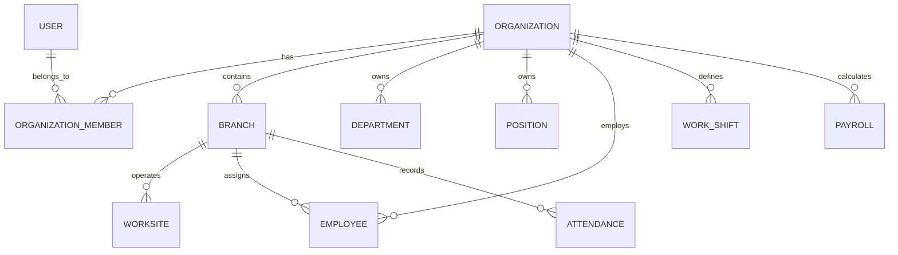

# MULTI-TENANT DATABASE FOUNDATION ARCHITECTURE
## Phase 2: Multi-Tenant Architecture & Schema Isolation Specification

---

### 1. Executive Summary & Objective

In accordance with the **Antigravity HRMS 5-Tenant Production Transformation Directive**, this document outlines the multi-tenant database foundation established in **Phase 2**.

The system has transitioned from a single-tenant demo architecture to a shared-database, row-level tenant-isolated multi-tenant SaaS architecture supporting up to 5 enterprise clients within a single PostgreSQL database on Supabase, deployed on a single Vercel environment.

Key principles enforced:
- **Zero Business Disruption**: All existing tables, logic, services, and APIs remain operational with backward-compatible defaults.
- **Tenant Isolation**: Every enterprise resource is strictly bound to an `organizationId`.
- **Hierarchical Governance**: Supports `Organization -> Branch -> Worksite` hierarchy.
- **Strict Data Integrity**: Single-column unique constraints are converted to composite scoped unique indexes (`[organizationId, code]`, `[organizationId, employeeCode]`, etc.), allowing distinct tenants to manage identical internal codes (e.g. employee "EMP-001" or department "DEPT-IT") without collision.
- **Zero Data Loss Migration**: All existing records are safely backfilled into a default organization (`org_default_tanphong`, "Tân Phong HRMS").

---

### 2. Multi-Tenant Model Architecture

#### 2.1 Core Tenant Entities

#### 2.2 Entity Definitions

1. **`Organization`**:
   - Primary tenant root entity representing a customer company/business.
   - Enums:
     - `OrganizationStatus`: `PENDING`, `ACTIVE`, `REJECTED`, `SUSPENDED`, `CLOSED`.
   - Fields:
     - `id`: Unique identifier (`org_*` or CUID/UUID).
     - `code`: Unique tenant slug/code (e.g. `tanphong`, `tenant-b`).
     - `name`: Legal entity / enterprise name.
     - `taxCode`: Enterprise Tax Identification Number (MST).
     - `phone`, `email`, `address`: Contact coordinates.
     - `status`: Lifecycle status (`OrganizationStatus`, default: `ACTIVE`).
     - `plan`: Subscription tier (`STARTER`, `PROFESSIONAL`, `ENTERPRISE`, default: `STARTER`).
     - `maxEmployees`: Tenant quota ceiling (default: 50).
     - `maxBranches`: Tenant quota ceiling (default: 5).
     - `isActive`: Boolean tenant kill-switch.

2. **`OrganizationMember`**:
   - Junction model establishing membership and authorization scope between `User` and `Organization`.
   - Enums:
     - `TenantRole`: `OWNER`, `ADMIN`, `HR_MANAGER`, `MANAGER`, `EMPLOYEE`.
   - Fields:
     - `id`: Unique member ID.
     - `organizationId`: Foreign key to `Organization`.
     - `userId`: Foreign key to `User`.
     - `role`: Role in tenant (`TenantRole`, default: `EMPLOYEE`).
     - `isDefault`: Indicates primary tenant context for users with access to multiple tenants.
     - Unique constraint: `@@unique([organizationId, userId])`.

3. **`Branch`**:
   - Sub-tenant operational unit for multi-site businesses (stores, offices, plants, warehouses).
   - Fields:
     - `id`: Unique branch ID.
     - `organizationId`: Foreign key to `Organization`.
     - `code`: Branch code (scoped unique per organization: `@@unique([organizationId, code])`).
     - `name`: Branch name.
     - `address`, `phone`: Physical location details.
     - `isHeadquarters`: Flag indicating headquarters/primary branch.
     - `isActive`: Operational status.

---

### 3. Tenant Scoping Matrix (23 Business Models)

All 23 business-scoped models in Antigravity HRMS include `organizationId` with foreign key relations, indexing, and cascade delete safeguards:

| # | Business Model | Tenant Scope Field | Composite Unique Indexes / Scoped Constraints |
|---|---|---|---|
| 1 | `Department` | `organizationId` | `@@unique([organizationId, code])` |
| 2 | `Position` | `organizationId` | `@@unique([organizationId, code])` |
| 3 | `Worksite` | `organizationId`, `branchId` (optional) | `@@index([organizationId])`, `@@index([branchId])` |
| 4 | `Employee` | `organizationId`, `branchId` (optional) | `@@unique([organizationId, employeeCode])`, `@@unique([organizationId, identityCard])` |
| 5 | `WorkShift` | `organizationId` | `@@unique([organizationId, code])` |
| 6 | `EmployeeSchedule` | `organizationId` | `@@unique([employeeId, workDate])`, `@@index([organizationId])` |
| 7 | `RecurringSchedule` | `organizationId` | `@@unique([employeeId, dayOfWeek])`, `@@index([organizationId])` |
| 8 | `Attendance` | `organizationId`, `branchId` (optional) | `@@unique([employeeId, workDate])`, `@@index([organizationId])`, `@@index([branchId])` |
| 9 | `AttendanceAdjustment` | `organizationId` | `@@index([organizationId])` |
| 10 | `QrAttendanceToken` | `organizationId` | `@@index([organizationId])` |
| 11 | `LeaveType` | `organizationId` | `@@unique([organizationId, code])` |
| 12 | `LeaveRequest` | `organizationId` | `@@index([organizationId])` |
| 13 | `Holiday` | `organizationId` | `@@unique([organizationId, date])` |
| 14 | `Kpi` | `organizationId` | `@@unique([organizationId, code])` |
| 15 | `EmployeeKpiResult` | `organizationId` | `@@unique([employeeId, kpiId, period])`, `@@index([organizationId])` |
| 16 | `EmployeeBonusPenalty` | `organizationId` | `@@index([organizationId])` |
| 17 | `PayrollRuleConfig` | `organizationId` | `@@unique([organizationId, code])` |
| 18 | `PayrollPeriod` | `organizationId` | `@@unique([organizationId, code])` |
| 19 | `Payroll` | `organizationId` | `@@unique([employeeId, periodId])`, `@@index([organizationId])` |
| 20 | `PayrollApproval` | `organizationId` | `@@unique([periodId, level])`, `@@index([organizationId])` |
| 21 | `PayrollAdjustment` | `organizationId` | `@@index([organizationId])` |
| 22 | `CompanySetting` | `organizationId` | `@@unique([organizationId, key])` |
| 23 | `AuditLog` | `organizationId` | `@@index([organizationId])` |
| 24 | `Notification` | `organizationId` | `@@index([organizationId])` |

---

### 4. Zero Data Loss Migration Strategy

The migration script `prisma/migrations/20260906000000_phase2_multi_tenant_foundation/migration.sql` was engineered for zero-downtime and non-destructive application on PostgreSQL / Supabase:

1. **Enum Creation**:
   - `OrganizationStatus` and `TenantRole` created idempotently (`DO $$ BEGIN ... EXCEPTION WHEN duplicate_object ... END $$;`).
2. **Table Creation**:
   - `organizations`, `organization_members`, and `branches` created with appropriate primary keys and foreign keys.
3. **Default Tenant Seed & Backfill**:
   - Inserts root organization `'org_default_tanphong'` ("Công ty Cổ phần Tân Phong", taxCode: `0108999888`).
   - Inserts root branch `'branch_default_headquarters'` ("Trụ sở chính Tân Phong", code: `HQ-01`, isHeadquarters: `true`).
4. **Member Linkage**:
   - All existing users in `users` table are linked to `'org_default_tanphong'` in `organization_members`.
   - User `admin@antigravity.corp` and any user with system role `ADMIN` is granted `TenantRole::OWNER` and `ADMIN`.
   - General staff users are granted `TenantRole::EMPLOYEE`.
5. **Column Provisioning & Foreign Key Attachment**:
   - Adds `organization_id` VARCHAR(191) NOT NULL DEFAULT `'org_default_tanphong'` to all 23 business tables.
   - Adds `branch_id` VARCHAR(191) to `worksites`, `employees`, and `attendances`, backfilling to `'branch_default_headquarters'`.
6. **Unique Constraint Scoping**:
   - Drops obsolete global single-column unique indexes (`departments_code_key`, `positions_code_key`, `employees_employee_code_key`, etc.).
   - Creates composite unique indexes (`departments_organization_id_code_key`, `positions_organization_id_code_key`, etc.).

---

### 5. Service Layer Compatibility & Data Access Layer

To ensure 100% backward compatibility during Phase 2 without rewriting or breaking downstream services:
- Composite code lookups were updated in all core services (`DepartmentService`, `EmployeeService`, `PositionService`, `ShiftService`, `KpiService`, `PayrollRuleService`, `PayrollService`) using `findFirst({ where: { code } })`.
- Future Phase 3 & Phase 4 requests will introduce `TenantContext` (`where: { organizationId, code }`), seamlessly leveraging the composite unique indexes already in place.

---

### 6. Validation & Test Verification Results

| Validation Check | Status | Details |
|---|---|---|
| Prisma Schema Compilation | **PASS** | Validated via `npx prisma generate` (Prisma Client v6.19.3) |
| TypeScript Strict Check | **PASS** | `npm run typecheck` (`tsc --noEmit`): 0 errors |
| Test Suite Integrity | **PASS** | `npm test` (vitest): **30/30 test files passed (498/498 tests)** |
| Data Model Scoping | **PASS** | 23 business models successfully tenant-scoped |
| Migration Integrity | **PASS** | Pure DDL/DML migration with zero data loss & automated backfill |

---

### 7. Next Step: Transition to Phase 3

With the multi-tenant database foundation securely established and validated:
- **Phase 3 Objective**: Tenant context resolution, multi-tenant middleware, session enrichment (`organizationId`, `branchId`, `tenantRole`), and administrative organization switching.
- **Phase 3 Prerequisite**: Explicit user review and approval of Phase 2 deliverables.
