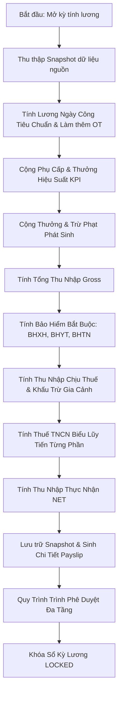

# ANTIGRAVITY MASTER PROJECT — ENTERPRISE PAYROLL CALCULATION ENGINE
**Kiến Trúc Động Cơ Tính Lương Chuẩn Pháp Lý & Độ Chính Xác Tuyệt Đối**  
*Document Version: 1.0.0 | Status: APPROVED | Target: High-Precision Transactional Engine*

---

## 1. TỔNG QUAN ĐỘNG CƠ TÍNH LƯƠNG (PAYROLL ENGINE ARCHITECTURE)

Động cơ tính lương của **Antigravity HRMS** là một hệ thống tính toán tài chính dạng luồng (Pipeline Engine), nhận dữ liệu đầu vào từ 5 nguồn độc lập:
1. **Dữ liệu Hợp đồng & Nhân sự**: Lương thỏa thuận, lương đóng bảo hiểm, phụ cấp cố định, số người phụ thuộc giảm trừ gia cảnh.
2. **Dữ liệu Chấm công & Lịch ca**: Ngày công chuẩn của tháng, số ngày làm việc thực tế, số ngày nghỉ phép có hưởng lương (Annual Leave / Paid Leave), số giờ làm thêm (OT ngày thường, ngày nghỉ cuối tuần, ngày lễ).
3. **Dữ liệu Hiệu suất KPI**: Điểm đánh giá KPI chu kỳ đã được Trưởng phòng phê duyệt, quy đổi thành hệ số thưởng hiệu suất công việc.
4. **Dữ liệu Thưởng & Phạt phát sinh**: Các quyết định thưởng nóng, phụ cấp đột xuất, hoặc chế tài phạt vi phạm nội quy đã được duyệt trong kỳ.
5. **Cấu hình Pháp lý & Luật lao động**: Tỷ lệ trích đóng bảo hiểm (BHXH, BHYT, BHTN), mức giảm trừ gia cảnh bản thân và người phụ thuộc, biểu thuế lũy tiến từng phần thuế TNCN.

---

## 2. QUY TRÌNH LUỒNG DỮ LIỆU TÍNH TOÁN (PIPELINE STEP-BY-STEP)



---

## 3. CÔNG THỨC TOÁN HỌC & ĐẶC TẢ PHÁP LÝ CHI TIẾT

Mọi phép toán đều sử dụng thư viện **`Decimal.js`** với độ chính xác vô hạn, sau đó làm tròn số nguyên gần nhất (Half-Up Rounding) theo quy định kế toán VNĐ:

### 3.1. Lương Thời Gian (Prorated Base Salary)
$$\text{Lương thời gian} = \frac{\text{Lương hợp đồng}}{\text{Ngày công chuẩn trong tháng}} \times (\text{Ngày công thực tế} + \text{Ngày nghỉ hưởng nguyên lương})$$
- *Trong đó*: Ngày công chuẩn thường là 22 hoặc 26 ngày tùy quy định doanh nghiệp được cấu hình trong `payroll_periods.standard_work_days`.

### 3.2. Tiền Làm Thêm Giờ (Overtime Pay - Theo Điều 98 Bộ Luật Lao Động)
$$\text{Đơn giá giờ làm việc bình thường} = \frac{\text{Lương hợp đồng}}{\text{Ngày công chuẩn} \times 8}$$
$$\text{Tiền OT} = \text{Đơn giá giờ} \times \left( \text{Giờ OT ngày thường} \times 1.5 + \text{Giờ OT ngày nghỉ cuối tuần} \times 2.0 + \text{Giờ OT ngày lễ, Tết} \times 3.0 \right)$$
*(Lưu ý: Phần thu nhập từ làm thêm giờ cao hơn mức làm việc bình thường được miễn thuế TNCN).*

### 3.3. Thưởng Hiệu Suất Theo KPI
$$\text{Hệ số KPI} = \begin{cases} 
1.2 & \text{nếu Điểm KPI} \ge 100\% \\ 
1.0 & \text{nếu } 90\% \le \text{Điểm KPI} < 100\% \\ 
0.8 & \text{nếu } 75\% \le \text{Điểm KPI} < 90\% \\ 
0.5 & \text{nếu } 50\% \le \text{Điểm KPI} < 75\% \\ 
0.0 & \text{nếu Điểm KPI} < 50\% 
\end{cases}$$
$$\text{Thưởng KPI} = \text{Quỹ thưởng vị trí} \times \text{Hệ số KPI}$$

### 3.4. Các Khoản Trích Đóng Bảo Hiểm Bắt Buộc (Người Lao Động Đóng)
- Lương căn cứ đóng bảo hiểm: $S_{ins} = \min(\text{Lương đóng bảo hiểm}, \text{Mức trần 20 lần lương cơ sở})$.
- **BHXH (Bảo hiểm xã hội)**: $S_{ins} \times 8\%$
- **BHYT (Bảo hiểm y tế)**: $S_{ins} \times 1.5\%$
- **BHTN (Bảo hiểm thất nghiệp)**: $\min(\text{Lương đóng bảo hiểm}, \text{20 lần lương tối thiểu vùng}) \times 1\%$
- **Tổng bảo hiểm khấu trừ**:
$$\text{Tổng BH} = \text{BHXH} + \text{BHYT} + \text{BHTN}$$

### 3.5. Thuế Thu Nhập Cá Nhân (PIT - Thuế TNCN)

#### Bước 1: Xác định Thu nhập chịu thuế
$$\text{Thu nhập chịu thuế} = \text{Tổng Gross} - \text{Phần OT được miễn thuế} - \text{Phụ cấp không chịu thuế (Ăn trưa, Điện thoại trong hạn mức)}$$

#### Bước 2: Xác định Thu nhập tính thuế (Assessable Income)
$$\text{Thu nhập tính thuế} = \max\left(0, \text{Thu nhập chịu thuế} - \text{Tổng BH} - \text{Giảm trừ bản thân (11.000.000)} - (\text{Số người phụ thuộc} \times 4.400.000)\right)$$

#### Bước 3: Áp dụng Biểu thuế lũy tiến từng phần (7 bậc)
| Bậc | Thu nhập tính thuế / tháng (Triệu VNĐ) | Thuế suất | Công thức tính nhanh |
| :---: | :--- | :---: | :--- |
| **1** | Đến 5 triệu | 5% | $\text{TNTT} \times 5\%$ |
| **2** | Trên 5 đến 10 triệu | 10% | $\text{TNTT} \times 10\% - 250.000$ |
| **3** | Trên 10 đến 18 triệu | 15% | $\text{TNTT} \times 15\% - 750.000$ |
| **4** | Trên 18 đến 32 triệu | 20% | $\text{TNTT} \times 20\% - 1.650.000$ |
| **5** | Trên 32 đến 52 triệu | 25% | $\text{TNTT} \times 25\% - 3.250.000$ |
| **6** | Trên 52 đến 80 triệu | 30% | $\text{TNTT} \times 30\% - 5.850.000$ |
| **7** | Trên 80 triệu | 35% | $\text{TNTT} \times 35\% - 9.850.000$ |

### 3.6. Thu Nhập Thực Nhận Cuối Cùng (NET TAKE-HOME PAY)
$$\mathbf{\text{Lương NET}} = \text{Tổng Gross} - \text{Tổng BH} - \text{Thuế TNCN} - \text{Các khoản phạt vi phạm nội quy}$$

---

## 4. QUẢN LÝ TRẠNG THÁI & TÍNH TOÀN VẸN GIAO DỊCH (IDEMPOTENCY & STATE MACHINE)

### 4.1. Cỗ máy trạng thái của Kỳ tính lương (State Machine)
```
[DRAFT] --(Tính lương hàng loạt)--> [CALCULATING]
                                           |
                                           v
[PENDING_APPROVAL] <---------------- [CALCULATED]
        |
        +--(Yêu cầu sửa đổi)-----> [DRAFT]
        |
        +--(HR & Ban Giám Đốc ký)--> [APPROVED]
                                           |
                                           v
                                        [PAID]
                                           |
                                           v
                                       [LOCKED] (Bất biến)
```

### 4.2. Bảo đảm tính Idempotent & Chống tính đè dữ liệu
- Khi chạy tính toán, toàn bộ logic được bọc trong một Prisma Transaction với Isolation Level `Serializable` hoặc `Repeatable Read`:
```typescript
await prisma.$transaction(async (tx) => {
  // 1. Khóa kỳ lương ở trạng thái CALCULATING
  const period = await tx.payrollPeriod.update({
    where: { id: periodId, status: 'DRAFT' },
    data: { status: 'CALCULATING' }
  });

  // 2. Xóa các chi tiết snapshot cũ nếu là lần chạy tính lại (Idempotency)
  await tx.payrollDetail.deleteMany({ where: { payroll: { period_id: periodId } } });
  await tx.payroll.deleteMany({ where: { period_id: periodId } });

  // 3. Thực thi batch calculation cho từng nhân viên đang ACTIVE...
  
  // 4. Cập nhật trạng thái thành CALCULATED
});
```

### 4.3. Xử lý điều chỉnh sau khóa sổ (Retroactive Adjustment Mechanism)
- Khi một kỳ lương đã chuyển sang trạng thái `LOCKED`, cơ sở dữ liệu ngăn chặn 100% mọi hành vi sửa/xóa bảng `payroll` của kỳ đó.
- Nếu có phát sinh sai lệch công hoặc khiếu nại được duyệt sau ngày khóa sổ, nhân viên nhân sự sẽ tạo một bản ghi `employee_bonuses_penalties` với phân loại `RETROACTIVE_ADJUSTMENT` áp dụng vào kỳ tính lương kế tiếp (Next Month Payroll) kèm giải trình rõ ràng và mã tham chiếu của kỳ gốc.
