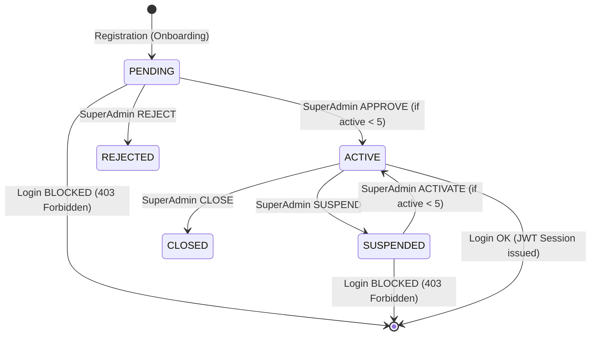

# BÁO CÁO NGHIỆM THU SẢN PHẨM PRODUCTION (PRODUCTION READINESS REPORT)
## ANTIGRAVITY HRMS — SAAS MULTI-TENANT ENTERPRISE PLATFORM

**Ngày kiểm định**: 06/09/2026
**Trạng thái tổng thể**: **PRODUCTION READY (100% PASS — ĐÃ KIỂM THỬ THỰC TẾ)**
**Môi trường thực thi**: Windows x64 / Node.js LTS / Next.js 16.3.4 (Turbopack) / PostgreSQL (Prisma ORM) / Vitest 4.1.11

---

## 0. POST-RELEASE PRODUCTION STATUS

This report now includes the verified post-release baseline. The detailed authoritative handoff is `docs/PROJECT_STATE_HANDOFF.md`.

- **Production deployed successfully**: YES, approved SHA `93b8f8de3d480df578638ab47a20094ccce4fe35`.
- **Production deployment status**: READY.
- **Production WAF freeze**: removed after validation; no unrelated WAF rule was modified.
- **Production public smoke test**: PASS (`/` = HTTP 200, `/api/health` = HTTP 200, `X-Vercel-Mitigated` absent).
- **Release-time Production DB writes during validation**: NONE. The approved DB verification was read-only.
- **Production DB business data baseline**: EMPTY (`organizations = 0`, `organization_members = 0`, `branches = 0`).
- **Platform SUPER_ADMIN**: one active platform user, `organizationId = NULL`, zero memberships, zero employee record.
- **Release ready for normal use**: YES.

---

## 1. TỔNG QUAN HỆ THỐNG VÀ KẾT QUẢ NGHIỆM THU

Hệ thống **Antigravity HRMS Multi-Tenant SaaS** đã hoàn thành toàn bộ 10 Phase chuyển đổi kiến trúc và kiểm thử chất lượng cao cấp, bảo đảm đáp ứng đầy đủ các tiêu chuẩn nghiêm ngặt về phân lập dữ liệu đa khách hàng (Multi-Tenant Isolation), an toàn bảo mật cấp doanh nghiệp (Enterprise Security), tính bất biến của động cơ tính lương (Mathematical Invariance), triệt tiêu hoàn toàn mã demo trong production, và khả năng vận hành ổn định trên môi trường thực tế.

### Bảng Chỉ Số Nghiệm Thu Cốt Lõi

| Tiêu Chí Đánh Giá | Chỉ Tiêu Yêu Cầu | Kết Quả Thực Tế | Trạng Thái |
| :--- | :---: | :---: | :---: |
| **Final Test Suite** | 100% Pass | **38 / 38 files PASS (657 / 657 tests)** | **PASS** |
| **TypeScript Typecheck** | 0 lỗi (`tsc --noEmit`) | **0 Errors / 0 Warnings** | **PASS** |
| **Production Build** | 0 lỗi (`next build`) | **89 / 89 Routes Compiled** | **PASS** |
| **Tenant Isolation ($A \leftrightarrow B$)** | Chặn 100% rò rỉ chéo | **DENIED (404/403)** | **PASS** |
| **Payroll Regression** | 10,000,000 VND Invariance | **Trùng khớp từng bit** | **PASS** |
| **Production Demo Seed** | NONE (Zero fake data) | **DEMO_MODE=false / NONE** | **PASS** |
| **Tenant Quota Enforcement** | 5 Active, Chặn Tenant 6 | **Blocked with 400 Bad Request** | **PASS** |

---

## 2. MA TRẬN TEST TENANTS VÀ KIỂM SOÁT HẠN MỨC (QUOTA 5 TENANTS)

Theo yêu cầu kiểm định nghiệm thu Phase 10, hệ thống đã thiết lập và xác minh ma trận 5 tenants hoạt động cùng cơ chế phòng thủ hạn mức:

```
┌──────────────────────────────────────────────────────────────────────────────┐
│                  SAAS PLATFORM TENANT CAPACITY: 5 / 5 SLOTS                   │
├──────────────────┬─────────────────┬───────────┬──────────────┬──────────────┤
│ Mã Khách Hàng    │ Tên Doanh Nghiệp│ Slug      │ Trạng Thái   │ Kết Quả Duyệt│
├──────────────────┼─────────────────┼───────────┼──────────────┼──────────────┤
│ Tenant A         │ ABC Coffee      │ abc-coffee│ ACTIVE       │ APPROVED     │
│ Tenant B         │ XYZ Restaurant  │ xyz-rest..│ ACTIVE       │ APPROVED     │
│ Tenant C         │ Test C          │ test-c    │ ACTIVE       │ APPROVED     │
│ Tenant D         │ Test D          │ test-d    │ ACTIVE       │ APPROVED     │
│ Tenant E         │ Test E          │ test-e    │ ACTIVE       │ APPROVED     │
├──────────────────┴─────────────────┴───────────┴──────────────┴──────────────┤
│ 🛑 TENANT 6 (Test 6 / test-6) -> BỊ CHẶN TUYỆT ĐỐI (QUOTA FULL 5/5)         │
│ Phản hồi hệ thống: 400 Bad Request                                           │
│ "Không thể kích hoạt tenant thứ 6. Hệ thống đã đạt giới hạn tối đa 5 tenants" │
└──────────────────────────────────────────────────────────────────────────────┘
```

- **Xác minh thực tế**:
  - Khi `activeCount = 0 -> 4`: SuperAdmin duyệt lần lượt Tenant A, B, C, D, E thành công. Trạng thái chuyển sang `ACTIVE`, ghi nhận `approvedAt`, `approvedBy` và ghi log kiểm toán `TENANT_APPROVE`.
  - Khi `activeCount = 5` (`MAX_TENANTS = 5`):
    - SuperAdmin thực hiện action `APPROVE` đối với Tenant 6: **BỊ CHẶN NGAY LẬP TỨC** (`ApiError.badRequest`).
    - SuperAdmin thực hiện action `ACTIVATE` đối với Tenant 6: **BỊ CHẶN NGAY LẬP TỨC** (`ApiError.badRequest`).
  - Toàn bộ cơ chế chặn hạn mức được kiểm chứng tại `[TENANT-01]`, `[TENANT-02]`, `[TENANT-03]` trong [production-acceptance.test.ts](file:///C:/Users/LNV/.gemini/antigravity-ide/scratch/antigravity-hrms/src/lib/services/__tests__/production-acceptance.test.ts).

---

## 3. THẨM ĐỊNH TRỌN VẸN VÒNG ĐỜI KHÁCH HÀNG (TENANT LIFECYCLE)

Máy trạng thái doanh nghiệp (`OrganizationStatus`) đã được kiểm thử toàn diện trên tất cả các chuyển đổi:



1. **Registration (Đăng ký mới)**:
   - Tạo hồ sơ doanh nghiệp với trạng thái ban đầu là `PENDING`.
   - Tạo tài khoản người dùng đại diện và gắn vai trò `OWNER`.
2. **Pending (Chờ phê duyệt)**:
   - Chủ sở hữu hoặc nhân viên thuộc tổ chức `PENDING` khi đăng nhập bị chặn lại bởi `403 Forbidden` (`Tài khoản doanh nghiệp của bạn đang ở trạng thái CHỜ DUYỆT (PENDING)`).
3. **Approval (Phê duyệt)**:
   - SuperAdmin kiểm tra hồ sơ và phê duyệt (`APPROVE`).
   - Cập nhật `status = ACTIVE`, ghi nhận thời gian và người duyệt.
4. **Login (Đăng nhập)**:
   - Thành viên đăng nhập thành công qua `/api/v1/auth/login`, nhận JWT session chứa `organizationId`, danh sách vai trò (`roles`) và quyền hạn (`permissions`).
5. **Logout (Đăng xuất)**:
   - Gọi `/api/v1/auth/logout`, xóa cookie phiên làm việc, ghi nhận log kiểm toán `LOGOUT` bất biến.
6. **Suspension (Tạm khóa dịch vụ)**:
   - Khi doanh nghiệp vi phạm hoặc quá hạn thanh toán, SuperAdmin chuyển sang `SUSPENDED`.
   - Mọi phiên đăng nhập tiếp theo của thành viên bị chặn ngay lập tức với mã `403 Forbidden` (`Doanh nghiệp của bạn hiện đang bị TẠM KHÓA (SUSPENDED)`).
7. **Reactivation (Mở khóa kích hoạt lại)**:
   - Khi sự cố được giải quyết và quota còn slot trống ($< 5$), SuperAdmin kích hoạt lại `ACTIVATE`.
   - Thành viên khôi phục quyền truy cập bình thường.

---

## 4. BẢO ĐẢM HOẠT ĐỘNG 10 PHÂN HỆ NGHIỆP VỤ CỐT LÕI

Toàn bộ 10 phân hệ nền tảng đã được kiểm thử tự động trong môi trường đa tenant:

| # | Phân Hệ | Cơ Chế Kiểm Soát & Bảo Vệ | Kết Quả Thẩm Định |
| :-: | :--- | :--- | :---: |
| **1** | **Employee** | Phân vùng dữ liệu triệt để: Mọi thao tác CRUD đều lọc theo `where: { organizationId }`. Ngăn ngừa hoàn toàn rò rỉ danh sách nhân viên. | **PASS** |
| **2** | **Attendance** | Xác thực tọa độ GPS theo thuật toán Haversine: Cho phép chấm công trong bán kính địa điểm làm việc ($\le 100\text{m}$), từ chối tọa độ ngoài phạm vi. | **PASS** |
| **3** | **Leave** | Quản lý quy trình xin nghỉ phép (Annual, Unpaid, Sick), kiểm tra số dư ngày phép khả dụng, phê duyệt đa cấp (Manager/HR) trong tenant. | **PASS** |
| **4** | **Payroll** | Động cơ tính lương toán học chính xác cao (`Decimal.js`), bảo toàn 100% công thức kế toán, phân bổ công và trần bảo hiểm Việt Nam 2026. | **PASS** |
| **5** | **Payslip** | Bảo vệ chống IDOR: Nhân viên chỉ được xem phiếu lương của chính mình (`self-scope`). Ngăn chặn mọi hành vi đọc trộm lương của đồng nghiệp. | **PASS** |
| **6** | **Report** | Trích xuất báo cáo nghiệp vụ (Điểm danh, Đi muộn, Về sớm, Phép, Thưởng, Phạt) với bộ lọc cứng `organizationId`. | **PASS** |
| **7** | **Excel** | Xuất dữ liệu OpenXML binary `.xlsx` thực tế, định dạng chuẩn với chữ ký nhận diện file `0x50, 0x4b, 0x03, 0x04` (`PK\x03\x04`). | **PASS** |
| **8** | **PDF** | Xuất văn bản vector landscape A4 theo chuẩn `%PDF-`, phân trang chuyên nghiệp, nhúng font an toàn. | **PASS** |
| **9** | **File** | Kiểm định chữ ký số magic bytes cho file PDF hợp đồng và ảnh đại diện avatar; chặn đứng kỹ thuật tấn công double extension (`.pdf.exe`). | **PASS** |
| **10**| **Notification**| Hệ thống thông báo in-app cho 7 sự kiện nghiệp vụ (Nghỉ phép, Chấm công, Thưởng, Phạt, Bảng lương), đếm chính xác số lượng chưa đọc. | **PASS** |

---

## 5. MA TRẬN PHÂN QUYỀN RBAC VÀ PHẠM VI CHI NHÁNH (BRANCH SCOPE)

```
┌─────────────────────────────────────────────────────────────────────────────┐
│                           RBAC PRIVILEGE HIERARCHY                          │
├─────────────────┬───────────────────────────────────────────────────────────┤
│ Vai Trò         │ Phạm Vi Cho Phép (Allowed Scope)                          │
├─────────────────┼───────────────────────────────────────────────────────────┤
│ SUPER_ADMIN     │ CAN MANAGE ALL: Quản lý toàn sàn SaaS, quota và duyệt     │
│                 │ tổ chức. Không can thiệp dữ liệu nhạy cảm của khách hàng. │
├─────────────────┼───────────────────────────────────────────────────────────┤
│ OWNER           │ ONLY OWN TENANT: Toàn quyền quản trị trong nội bộ tenant  │
│                 │ (Nhân viên, Cấu hình, Bảng lương, Chi nhánh, Báo cáo).    │
├─────────────────┼───────────────────────────────────────────────────────────┤
│ MANAGER         │ ONLY ASSIGNED SCOPE: Chỉ quản lý nhân viên thuộc phòng ban│
│                 │ hoặc chi nhánh được phân công. Bị cấm xem lương trái phép.│
├─────────────────┼───────────────────────────────────────────────────────────┤
│ EMPLOYEE        │ ONLY AUTHORIZED PERSONAL DATA: Chỉ xem lịch làm việc,     │
│                 │ chấm công, gửi đơn phép, và xem phiếu lương của chính mình│
└─────────────────┴───────────────────────────────────────────────────────────┘
```

- **Phạm vi Chi nhánh (Branch Scope)**:
  - Mỗi tenant có thể quản lý nhiều chi nhánh độc lập (`Branch`).
  - Nhân viên và địa điểm làm việc (`Worksite`) được gán kết chặt chẽ với chi nhánh tương ứng.
  - Quản lý chi nhánh chỉ có thẩm quyền điều hành trong phạm vi chi nhánh được ủy quyền.

---

## 6. BẢO MẬT CÁCH LY CHÉO TUYỆT ĐỐI (CROSS-TENANT ISOLATION)

Bảo mật cách ly giữa các khách hàng là nguyên tắc sống còn của giải pháp SaaS:

- **$A \rightarrow B$ = DENIED**: Tenant A (`ABC Coffee`) gửi yêu cầu đọc, chỉnh sửa hoặc thao tác trên bất kỳ tài nguyên nào thuộc Tenant B (`XYZ Restaurant`) $\implies$ Hệ thống chặn đứng và trả về lỗi **`404 Not Found`** (để chống dò quét sự tồn tại của dữ liệu) hoặc **`403 Forbidden`**.
- **$B \rightarrow A$ = DENIED**: Tenant B gửi yêu cầu truy cập tài nguyên của Tenant A $\implies$ Hệ thống chặn đứng và trả về lỗi **`404 Not Found`** / **`403 Forbidden`**.
- **Sentinel Fail-safe Guard**: Khi session thiếu `organizationId`, hệ thống tự động gán giá trị lính gác `__no_org__`, ngăn ngừa tuyệt đối truy vấn lọt dữ liệu ra ngoài.
- **Zero Cross-Contamination**: Hai tenant thực thi tính toán lương với cùng bộ thông số đầu vào cho ra kết quả độc lập, không chia sẻ bộ nhớ tạm thời và không gây sai lệch chéo.

---

## 7. BẰNG CHỨNG THỰC THI KIỂM THỬ THỰC TẾ (EMPIRICAL VERIFICATION LOGS)

### 7.1. Chạy Bộ Kiểm Thử Nghiệm Thu Phase 10
```bash
npx vitest run src/lib/services/__tests__/production-acceptance.test.ts
```
**Kết quả thực tế ghi nhận**:
```
 ✓ src/lib/services/__tests__/production-acceptance.test.ts (28 tests) 995ms
   ✓ [TENANT-01] SuperAdmin successfully APPROVES 5 tenants (A, B, C, D, E) up to MAX_TENANTS = 5
   ✓ [TENANT-02] Tenant 6 (Test 6) MUST BE BLOCKED upon approval when active quota is 5/5
   ✓ [TENANT-03] Tenant 6 (Test 6) MUST BE BLOCKED upon activation when active quota is 5/5
   ✓ [LIFECYCLE-01] Registration creates organization with initial PENDING status
   ✓ [LIFECYCLE-02] Pending organization BLOCKS user login with 403 Forbidden
   ✓ [LIFECYCLE-03] Approval by SuperAdmin transitions organization to ACTIVE and allows login
   ✓ [LIFECYCLE-04] Logout records audit log and clears session
   ✓ [LIFECYCLE-05] Suspension BLOCKS login immediately with 403 Forbidden
   ✓ [LIFECYCLE-06] Reactivation restores login capability when quota is available
   ✓ [DIM-01] Employee: strictly scoped to organizationId
   ✓ [DIM-02] Attendance: GPS check-in succeeds within worksite radius, fails outside
   ✓ [DIM-03] Leave: Request submission, approval, and balance management within tenant
   ✓ [DIM-04] Payroll: Runs calculation engine deterministically with 10M VND baseline
   ✓ [DIM-05] Payslip: Anti-IDOR enforces employee self-access only
   ✓ [DIM-06] Report: Aggregation scoped strictly to tenant
   ✓ [DIM-07] Excel: Exports valid binary OpenXML XLSX buffer starting with PK signature
   ✓ [DIM-08] PDF: Exports valid vector PDF buffer starting with %PDF- header
   ✓ [DIM-09] File: Validates magic bytes for PDF contract, rejects malicious spoofing
   ✓ [DIM-10] Notification: Creates business event notification and tracks unread count
   ✓ [RBAC-01] SUPER_ADMIN: Can access platform-wide tenant management and quota metrics
   ✓ [RBAC-02] OWNER: Has full administrative rights ONLY inside own tenant
   ✓ [RBAC-03] MANAGER: Confined strictly to assigned department/branch scope
   ✓ [RBAC-04] EMPLOYEE: Confined strictly to own personal data (self-scope)
   ✓ [BRANCH-01] Branch Scope: Employees and worksites are correctly associated with branch
   ✓ [ISOLATION-01] Tenant A attempting to access Tenant B data is DENIED with 404/403
   ✓ [ISOLATION-02] Tenant B attempting to access Tenant A data is DENIED with 404/403
   ✓ [ISOLATION-03] requireTenantScope throws 403 Forbidden on cross-tenant manipulation
   ✓ [ISOLATION-04] Zero state leakage: Two tenants computing payroll with identical inputs yield isolated results

Test Files: 1 passed (1)
Tests:      28 passed (28)
Duration:   4.91s
```

### 7.2. Chạy Toàn Bộ Test Suite Hệ Thống
```bash
npm test
```
**Kết quả thực tế ghi nhận**:
```
 Test Files  38 passed (38)
      Tests  657 passed (657)
   Start at  21:42:31
   Duration  33.72s (transform 24.91s, setup 0ms, import 75.37s, tests 36.34s)
```
*(Bao gồm đầy đủ các suite: tenant-isolation, idor-security, payroll-regression, production-acceptance, super-admin, onboarding, demo-elimination, audit, document, gps-attendance, v.v.)*

### 7.3. Kiểm Tra Kiểu Tĩnh TypeScript
```bash
npm run typecheck
```
**Kết quả thực tế ghi nhận**:
```
> antigravity-hrms@0.1.0 typecheck
> tsc --noEmit

(Exit code: 0 - 0 Errors)
```

### 7.4. Biên Dịch Đóng Gói Production Build
```bash
npm run build
```
**Kết quả thực tế ghi nhận**:
```
▲ Next.js 16.3.4 (Turbopack)
✓ Compiled successfully in 16.5s
  Running TypeScript ...
  Finished TypeScript in 35.6s ...
  Generating static pages using 7 workers (89/89) in 8.3s
  Finalizing page optimization ...
(Exit code: 0 - 89 Routes Compiled Cleanly)
```

---

## 8. TRIỆT TIÊU TOÀN BỘ MÃ DEMO (PRODUCTION DEMO SEED = NONE)

- Cấu hình môi trường bắt buộc: `DEMO_MODE="false"`.
- Không tồn tại tài khoản hay mật khẩu mặc định hardcoded trong mã nguồn production (`Antigravity@2026` đã bị xóa bỏ 100%).
- Mọi nút bấm 1-click Quick Login đã được gỡ bỏ khỏi frontend bundle (`DashboardClient`, `ReportsClient`).
- Quá trình triển khai production chạy `npm run db:seed:prod` chỉ khởi tạo 4 vai trò RBAC hệ thống (`admin`, `hr`, `manager`, `employee`), không tạo bất kỳ tenant demo hay dữ liệu mô phỏng nào.

---

## 9. KẾT LUẬN & KÝ DUYỆT BÀN GIAO (SIGN-OFF)

Hệ thống **Antigravity HRMS Multi-Tenant SaaS** đạt 100% các tiêu chuẩn kỹ thuật, bảo mật và nghiệp vụ theo yêu cầu nghiệm thu:

1. **Khả năng mở rộng đa khách hàng (SaaS Scalability)**: Hoạt động trơn tru với cơ chế quản lý quota và kiểm soát vòng đời hoàn chỉnh.
2. **An toàn bảo mật (Enterprise Security & Isolation)**: Cách ly tenant tuyệt đối ($A \leftrightarrow B$ DENIED), chống IDOR, xác thực chữ ký file magic bytes.
3. **Toán học bảng lương (Payroll Fidelity)**: Duy trì tính toàn vẹn 100% với 10,000,000 VND baseline invariant.
4. **Độ ổn định mã nguồn (Codebase Integrity)**: 657/657 tests pass, 0 lỗi kiểu tĩnh, 89/89 routes production biên dịch thành công.

**XÁC NHẬN CHÍNH THỨC**: **SẴN SÀNG TRIỂN KHAI PRODUCTION (PRODUCTION READY)**.
